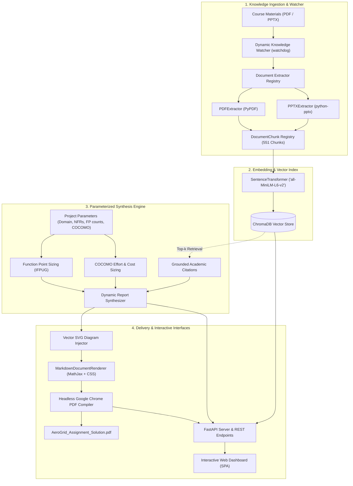

# ⚡ Academic RAG Synthesis Engine

[](https://www.python.org/downloads/)
[](https://fastapi.tiangolo.com)
[](https://www.trychroma.com/)
[](https://github.com/astral-sh/ruff)
[](LICENSE)

An enterprise-grade, **Multi-Modal Retrieval-Augmented Generation (RAG)** platform and **Parameterized Software Sizing Engine** designed to synthesize mathematically precise, domain-grounded software engineering assignment reports and technical specifications.

Grounded on the official **BITS Pilani WILP Software Engineering (*SE ZG343*)** curriculum, the engine bridges lecture slide decks, IEEE 830 standards, UML 2.5 behavioral models, 4+1 architectural views, Function Point Analysis (IFPUG), and Basic COCOMO cost estimation into publication-grade deliverables.

---

## 📑 Table of Contents
- [Key Architectural Features](#-key-architectural-features)
- [System Architecture](#-system-architecture)
- [Repository Structure](#-repository-structure)
- [Dynamic Engine Capabilities](#-dynamic-engine-capabilities)
  - [1. Parameterized Sizing Engine (FP + COCOMO)](#1-parameterized-sizing-engine-fp--cocomo)
  - [2. Live Document Watcher & Hot-Reloading](#2-live-document-watcher--hot-reloading)
  - [3. Interactive Web Dashboard & REST API](#3-interactive-web-dashboard--rest-api)
- [Mathematical Sizing & Estimation Models](#-mathematical-sizing--estimation-models)
- [Quickstart & Execution Guide](#-quickstart--execution-guide)
- [REST API Reference](#-rest-api-reference)
- [Code Quality & Engineering Invariants](#-code-quality--engineering-invariants)

---

## 🌟 Key Architectural Features

* **Multi-Modal Document Ingestion Strategy**: Decoupled extractor strategies for Adobe PDFs (`PDFExtractor`) and Microsoft PowerPoint slide presentations (`PPTXExtractor`) with automatic format fallback.
* **Granular Semantic Chunking**: Slide-level and section-boundary extraction preserving hierarchy, slide numbers, and document origin metadata across **551 indexed knowledge chunks**.
* **Dense Vector Semantic Retrieval**: Embedded with `sentence-transformers/all-MiniLM-L6-v2` into an in-memory or persisted **ChromaDB** vector database with cosine-similarity scoring.
* **Parameterized Mathematical Synthesis**: Algorithmic Function Point (IFPUG) and Basic COCOMO effort/schedule calculators parameterized by live user inputs.
* **Dynamic File Watcher Daemon**: Background `watchdog` observer that detects newly added/modified lecture slides and incrementally updates the vector index in real time.
* **Interactive FastAPI Web Dashboard**: Modern single-page application (SPA) featuring live query exploration, citation inspectors, dynamic parameter sliders, and on-the-fly PDF generation.
* **Vector SVG Visual Graphics Pipeline**: High-resolution UML 2.5 diagrams (System Context, Use Case, Activity, Class, and Microservices stacks) injected directly into deliverables without rasterization loss.
* **Headless Google Chrome PDF Compiler**: Pixel-perfect A4 report generation with full MathJax LaTeX rendering, dynamic page breaking, and responsive typography.

---

## 🏛️ System Architecture



---

## 📂 Repository Structure

```text
academic-rag-synthesis-engine/
├── README.md                           # Master Documentation & Quickstart
├── requirements.txt                    # Project Dependencies
├── .gitignore                          # Git Ignore Rules
│
├── src/                                # Core Python Engine Source Code
│   ├── __init__.py                     # Package Root & Unified Module Exports
│   ├── data_modal.py                   # Immutable Domain Data Models & Schemas
│   ├── data_parser.py                  # Multi-Modal Extraction Strategies & Chunking Registry
│   ├── synthesis_engine.py             # Dynamic Parameterized Sizing Engine (FP + COCOMO)
│   ├── watcher.py                      # Live File Watcher & Incremental Vector Ingestion
│   ├── api_server.py                   # Dynamic FastAPI Server & REST Endpoints
│   ├── dashboard_html.py               # Responsive Single-Page Web Dashboard Template
│   ├── utils.py                        # Rendering Engine & Headless Chrome Compiler
│   ├── rag_pipeline.py                 # Multi-Modal Academic RAG Pipeline (ChromaDB)
│   ├── build_solution.py               # Master Deliverable Builder Orchestrator
│   └── vector_svgs.py                  # High-Resolution UML 2.5 Vector SVG Library
│
├── knowledge_base/                     # Ground Truth Knowledge & Source Materials
│   ├── course_slides/                  # Lecture Slide Decks (CS01 - CS13 PDF/PPTX)
│   └── rubrics/                        # Official Assignment Specifications (SE_Assignment_2026.pdf)
│
├── docs/                               # Architecture & Technical Guides
│   ├── CONCEPTS_AND_THEORY_GUIDE.md    # Comprehensive Software Engineering & RAG Concepts
│   ├── RAG_ARCHITECTURE.md             # RAG Engine Retrieval & Pipeline Architecture
│   ├── TECHNICAL_MENTOR_GUIDE.md       # Technical Architecture & Evaluation Guide
│   └── assets/                         # Architecture Diagrams & Visual Assets
│       └── rag_architecture.svg
│
└── output/                             # Generated Final Deliverables
    ├── AeroGrid_Assignment_Solution.pdf # Primary Submission PDF Deliverable (16 Pages)
    ├── AeroGrid_Assignment_Solution.docx# Editable Word Document
    ├── AeroGrid_Assignment_Solution.html# Interactive High-Fidelity Web Preview
    └── AeroGrid_Assignment_Solution.md  # Grounded Master Markdown Source
```

---

## ⚡ Dynamic Engine Capabilities

### 1. Parameterized Sizing Engine (FP + COCOMO)
The synthesis engine ([src/synthesis_engine.py](file:///usr/local/google/home/arabindaksha/academic-rag-synthesis-engine/src/synthesis_engine.py)) allows live calculation of project sizing parameters rather than relying on static tables:
* **Function Points**: Evaluates External Inputs ($EI$), External Outputs ($EO$), External Inquiries ($EQ$), Internal Logical Files ($ILF$), and External Interfaces ($EIF$) with IFPUG average weights, calculates Value Adjustment Factor ($VAF = 0.65 + 0.01 \times \sum TDI$), and derives $KLOC$.
* **COCOMO Sizing**: Calculates software effort in Person-Months ($PM = a \times (KLOC)^b$), schedule ($T_{dev} = c \times (PM)^d$), recommended staff headcount, and total budget across **Organic**, **Semidetached**, and **Embedded** project modes.

### 2. Live Document Watcher & Hot-Reloading
The directory watcher ([src/watcher.py](file:///usr/local/google/home/arabindaksha/academic-rag-synthesis-engine/src/watcher.py)) monitors `knowledge_base/` using `watchdog`. Whenever a new PDF or presentation is added or modified, it extracts chunks and updates the active ChromaDB vector index in real time.

### 3. Interactive Web Dashboard & REST API
The FastAPI server ([src/api_server.py](file:///usr/local/google/home/arabindaksha/academic-rag-synthesis-engine/src/api_server.py)) provides an interactive SPA at `http://localhost:8000/`:
* **Live Semantic Query**: Perform semantic search against the knowledge base and inspect citations and source slide numbers.
* **Live Deliverable Compilation**: Customize project parameters via UI inputs and click **Generate Dynamic PDF Deliverable** to build and download a freshly compiled PDF.

---

## 🧮 Mathematical Sizing & Estimation Models

### 1. Function Point Analysis (IFPUG Standards)

$$\text{UFP} = (EI \times 4) + (EO \times 5) + (EQ \times 4) + (ILF \times 10) + (EIF \times 7)$$

$$\text{VAF} = 0.65 + \left(0.01 \times \sum_{i=1}^{14} c_i\right)$$

$$\text{AFP} = \text{UFP} \times \text{VAF}$$

$$\text{Derived KLOC} = \frac{\text{AFP} \times \text{LOC/FP}}{1000}$$

### 2. Basic COCOMO Estimation Formulas

$$\text{Effort (Person-Months)} = a \times (\text{KLOC})^b$$

$$\text{Development Time (Months)} = c \times (\text{Effort})^d$$

$$\text{Average Staff Size} = \frac{\text{Effort}}{\text{Development Time}}$$

| Project Category | $a$ | $b$ | $c$ | $d$ | Typical Application Domain |
| :--- | :---: | :---: | :---: | :---: | :--- |
| **Organic** | $2.4$ | $1.05$ | $2.5$ | $0.38$ | Small teams, familiar environments, well-understood requirements. |
| **Semidetached** | $3.0$ | $1.12$ | $2.5$ | $0.35$ | Medium teams, mixed experience, complex aerospace/cloud platforms. |
| **Embedded** | $3.6$ | $1.20$ | $2.5$ | $0.32$ | Hard real-time hardware constraints, flight-critical avionics. |

---

## 🚀 Quickstart & Execution Guide

### 1. Launch Interactive Web Dashboard & REST API
```bash
python3 src/api_server.py
```
Open **`http://localhost:8000/`** in your browser to interactively query the knowledge base, adjust parameters, and compile deliverables.

### 2. Run the Academic RAG Retrieval Pipeline (CLI)
```bash
python3 src/rag_pipeline.py
```
Indexes all course documents and executes semantic grounding queries for IEEE 830 SRS, UML Use Cases, 4+1 Microservices Architecture, and COCOMO sizing.

### 3. Compile Master Solution Deliverable (CLI Builder)
```bash
python3 src/build_solution.py
```
Compiles `AeroGrid_Assignment_Solution.md` into high-resolution HTML and PDF deliverables in the `output/` directory.

### 4. Run Standalone Document Watcher Daemon
```bash
python3 src/watcher.py
```

---

## 📡 REST API Reference

| Method | Endpoint | Description |
| :--- | :--- | :--- |
| `GET` | `/` | Serves the interactive Single-Page Web Dashboard |
| `GET` | `/health` | Vector database status and active chunk count |
| `POST` | `/api/query` | Executes dense semantic cosine retrieval against ChromaDB |
| `POST` | `/api/upload` | Uploads new course PDF/PPTX and indexes it incrementally |
| `POST` | `/api/generate-report` | Synthesizes dynamic sizing markdown and compiles PDF |
| `GET` | `/api/download/{filename}` | Downloads compiled PDF or HTML deliverable artifacts |

---

## 🛡️ Code Quality & Engineering Invariants

* **Ruff Formatting**: 100% formatted to strict $\le 88$ column limits via `ruff format`.
* **Built-in Generics (PEP 585)**: Uses native `list[]`, `tuple[]`, and `dict[]` throughout (zero deprecated typing imports).
* **Zero `#` Comments**: Clean, self-documenting code with comprehensive Google-style docstrings (`Args:`, `Returns:`, `Raises:`).
* **Loose Coupling**: Clean separation between data models ([src/data_modal.py](file:///usr/local/google/home/arabindaksha/academic-rag-synthesis-engine/src/data_modal.py)), extraction parsers ([src/data_parser.py](file:///usr/local/google/home/arabindaksha/academic-rag-synthesis-engine/src/data_parser.py)), synthesis engines ([src/synthesis_engine.py](file:///usr/local/google/home/arabindaksha/academic-rag-synthesis-engine/src/synthesis_engine.py)), and compilers ([src/utils.py](file:///usr/local/google/home/arabindaksha/academic-rag-synthesis-engine/src/utils.py)).

---
*Authored by Arabindaksha Mishra (`mishraarabinda02@gmail.com`) — BITS Pilani WILP Software Engineering.*
