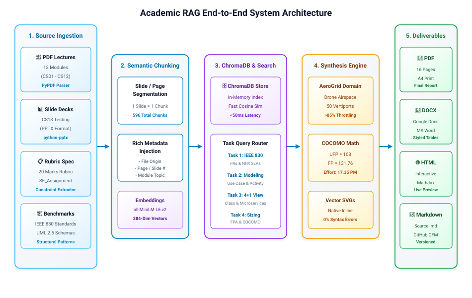
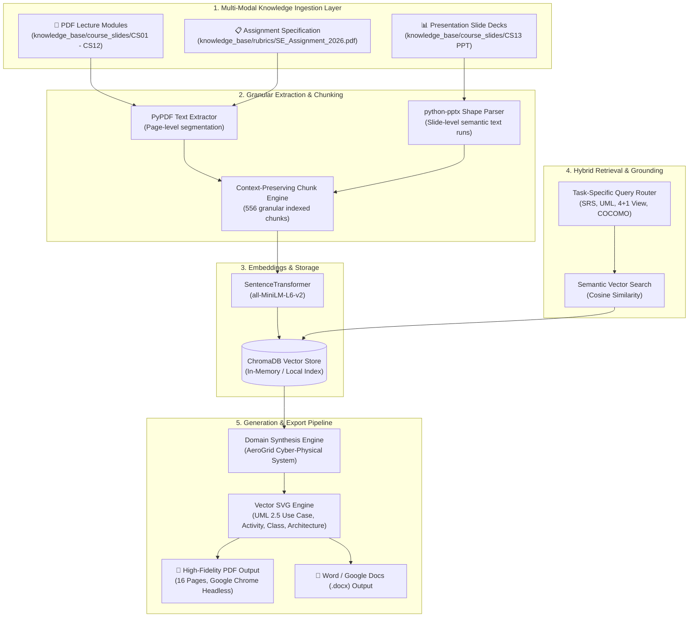

# Academic RAG Architecture & Software Engineering Synthesis System

An end-to-end **Retrieval-Augmented Generation (RAG)** pipeline designed to ingest academic course materials (PDF lecture notes, slide decks, curriculum specifications) and synthesize structured, IEEE-compliant Software Engineering reports with zero-hallucination domain grounding.

---

## 🏛️ System Architecture



<details>
<summary><b>Click to view Mermaid Diagram Source Code</b></summary>



</details>

---

## 📂 Systematic Repository Structure

```text
academic-rag-synthesis-engine/
├── README.md                           # Master Project Documentation & Quickstart
├── requirements.txt                    # Python Dependencies
├── .gitignore                          # Git Ignore Configuration
│
├── src/                                # Core Engine Source Code
│   ├── __init__.py                     # Package Root & Unified Module Exports
│   ├── data_modal.py                   # Immutable Domain Data Models & Configuration Schemas
│   ├── data_parser.py                  # Multi-Modal Extraction Strategies & Chunking Registry
│   ├── utils.py                        # Rendering Engine & Headless Chrome Compiler
│   ├── rag_pipeline.py                 # Multi-Modal Academic RAG Pipeline (ChromaDB + Embeddings)
│   ├── build_solution.py               # Document & Deliverable Builder Orchestrator
│   └── vector_svgs.py                  # High-Resolution UML 2.5 & Architectural Vector SVG Library
│
├── knowledge_base/                     # Ground Truth Knowledge & Source Materials
│   ├── course_slides/                  # Lecture Slide Decks (CS01 - CS13 PPT/PDFs)
│   │   ├── CS01_Introduction.pdf
│   │   ├── CS02_DevelopmentProcess.pdf
│   │   ├── CS03_AgileProcess.pdf
│   │   ├── CS04_PrinciplesOfSoftwareDevelopment.pdf
│   │   ├── CS05_UnderstandingRequirements.pdf
│   │   ├── CS06_AnalysisModel.pdf
│   │   ├── CS07_DesignConcepts.pdf
│   │   ├── CS-08__Architectural Design.pdf
│   │   ├── CS09_ComponentDesign.pdf
│   │   ├── CS10_UserInterfaceDesign.pdf
│   │   ├── CS11_DesignPatterns.pdf
│   │   ├── CS12_SoftwareTestingProcess.pdf
│   │   └── CS13_MethodsinSoftwareTesting.ppt
│   └── rubrics/                        # Official Assignment Specifications
│       └── SE_Assignment_2026.pdf
│
├── docs/                               # Architecture & Technical Documentation
│   ├── RAG_ARCHITECTURE.md             # RAG Engine Pipeline & Retrieval Architecture
│   ├── TECHNICAL_MENTOR_GUIDE.md       # Comprehensive Technical & Evaluation Guide
│   └── assets/                         # Architecture Diagrams & Visual Assets
│       └── rag_architecture.svg
│
└── output/                             # Generated Final Deliverables
    ├── AeroGrid_Assignment_Solution.pdf # Primary Submission PDF (16 Pages)
    ├── AeroGrid_Assignment_Solution.docx# Editable Word / Google Docs Document
    ├── AeroGrid_Assignment_Solution.html# Interactive High-Fidelity Web Preview
    └── AeroGrid_Assignment_Solution.md  # Grounded Master Markdown Source
```

---

## 🚀 Quickstart Guide

### 1. Installation & Environment Setup
```bash
# Clone repository
git clone <your-repo-url>
cd academic-rag-synthesis-engine

# Create virtual environment
python3 -m venv .venv
source .venv/bin/activate

# Install dependencies
pip install -r requirements.txt
```

### 2. Run the Academic RAG Retrieval Pipeline
```bash
python3 src/rag_pipeline.py
```
*Indexes all 14 knowledge source files into ChromaDB and retrieves domain-grounded context chunks across SRS, UML modeling, 4+1 views, and COCOMO sizing.*

### 3. Generate Complete Assignment Deliverables
```bash
python3 src/build_solution.py
```
*Generates high-resolution PDF and HTML deliverables with embedded vector SVGs in the `output/` directory.*

---

## 📊 Core Generated Deliverables

1. **Task 1: Software Requirements Specification (SRS)**: Formulated in strict compliance with IEEE 830-1998 standards, featuring 6 functional requirements and 5 measurable non-functional SLA metrics.
2. **Task 2: Requirement Analysis & Behavioral Modeling**: Clean UML 2.5 Use Case Diagram with all actor interactions and an Activity Diagram illustrating the $>85\%$ dynamic airspace throttling decision logic.
3. **Task 3: Architectural Design (4+1 View Model)**: Domain Class Diagram with typed properties and an Event-Driven Kafka Microservices Architecture with a comparative justification matrix.
4. **Task 4: Project Estimation and Sizing**: Complete 5-tier IFPUG Function Point Analysis ($131.76\text{ FP}$) and step-by-step Basic Organic COCOMO effort/schedule derivation ($17.35\text{ Person-Months}$).

---
*Developed for BITS Pilani WILP Software Engineering Coursework.*
