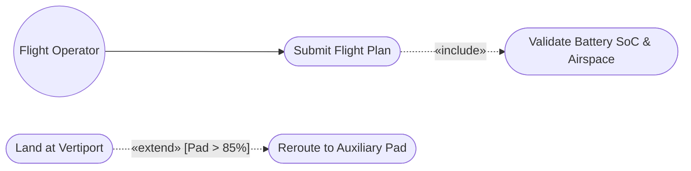

# 📚 Comprehensive Software Engineering, AI/RAG & Architecture Concepts Guide

**Document Type:** Comprehensive Theoretical, Mathematical & Practical Concepts Manual  
**Author:** Arabindaksha Mishra (`mishraarabinda02@gmail.com`)  
**Target Course:** SE ZG343 Software Engineering (BITS Pilani WILP)  

---

## 📑 Table of Contents
1. [AI, NLP & Retrieval-Augmented Generation (RAG) Concepts](#1-ai-nlp--retrieval-augmented-generation-rag-concepts)
   - [1.1 Retrieval-Augmented Generation (RAG)](#11-retrieval-augmented-generation-rag)
   - [1.2 Token Context Windows & The "Lost in the Middle" Effect](#12-token-context-windows--the-lost-in-the-middle-effect)
   - [1.3 Dense Vector Space Embeddings & Bi-Encoder Models](#13-dense-vector-space-embeddings--bi-encoder-models)
   - [1.4 Vector Distance Metrics & Cosine Similarity Mathematics](#14-vector-distance-metrics--cosine-similarity-mathematics)
   - [1.5 Vector Databases & Hierarchical Navigable Small World (HNSW) Indexing](#15-vector-databases--hierarchical-navigable-small-world-hnsw-indexing)
   - [1.6 Structural & Semantic Boundary Chunking vs. Fixed Slicing](#16-structural--semantic-boundary-chunking-vs-fixed-slicing)
   - [1.7 Task-Specific Query Routing & Grounded Context Blocks](#17-task-specific-query-routing--grounded-context-blocks)
   - [1.8 Real-Time Document Watching & Hot-Reloading (`watchdog`)](#18-real-time-document-watching--hot-reloading-watchdog)
2. [Software Engineering, Requirements & Modeling Concepts](#2-software-engineering-requirements--modeling-concepts)
   - [2.1 IEEE 830 Software Requirements Specification (SRS)](#21-ieee-830-software-requirements-specification-srs)
   - [2.2 Behavioral Modeling: UML 2.5 Use Case & Activity Diagrams](#22-behavioral-modeling-uml-25-use-case--activity-diagrams)
   - [2.3 Kruchten's 4+1 Architectural View Model](#23-kruchtens-41-architectural-view-model)
   - [2.4 Microservices Architecture & Event-Driven Systems](#24-microservices-architecture--event-driven-systems)
3. [Software Sizing, Estimation & Mathematical Metrics](#3-software-sizing-estimation--mathematical-metrics)
   - [3.1 Function Point Analysis (IFPUG FPA)](#31-function-point-analysis-ifpug-fpa)
   - [3.2 Barry Boehm's Basic COCOMO Estimation Model](#32-barry-boehms-basic-cocomo-estimation-model)
4. [Document Engineering, Vector Graphics & Publishing](#4-document-engineering-vector-graphics--publishing)
   - [4.1 Scalable Vector Graphics (SVG) vs. Client-Side JS Diagrammers](#41-scalable-vector-graphics-svg-vs-client-side-js-diagrammers)
   - [4.2 Headless Chrome PDF Compilation & MathJax LaTeX Typesetting](#42-headless-chrome-pdf-compilation--mathjax-latex-typesetting)
   - [4.3 Applied Object-Oriented Software Design Patterns](#43-applied-object-oriented-software-design-patterns)

---

# 1. AI, NLP & Retrieval-Augmented Generation (RAG) Concepts

---

### 1.1 Retrieval-Augmented Generation (RAG)

#### What It Is
Retrieval-Augmented Generation (RAG) is an AI architectural pattern that dynamically enhances Large Language Model (LLM) responses by retrieving factual, authoritative domain knowledge from an external database before generating output. Instead of relying solely on the static weights learned during pre-training, the model receives grounded, verifiable text snippets directly within its prompt context.

```
┌────────────────────────────────────────────────────────────────────────────────────────┐
│                              RAG ARCHITECTURAL WORKFLOW                                │
│                                                                                        │
│   [User Query] ──────► [Embedding Model] ──────► [Vector DB Search]                   │
│                                                          │                             │
│                                                          ▼                             │
│   [Grounded Response] ◄───── [LLM Engine] ◄───── [Context Block + Prompt]              │
└────────────────────────────────────────────────────────────────────────────────────────┘
```

#### Why We Use It
* **Elimination of Hallucinations**: Pre-trained LLMs generate statistically plausible but factually incorrect assertions (e.g., inventing non-existent IEEE standards or fabricating COCOMO constants). RAG forces the model to synthesize answers strictly from retrieved courseware.
* **Domain Currency & Private Data**: Pre-trained models cannot know your internal documents, updated course slides, or newly published rubrics without expensive fine-tuning.
* **Deterministic Citations**: RAG provides transparent traceability by linking every generated requirement or equation back to an exact source file and slide number.

#### Trade-Off Analysis: RAG vs. Fine-Tuning vs. In-Context Stuffing
| Dimension | Direct Context Stuffing | Model Fine-Tuning | Retrieval-Augmented Generation (RAG) |
| :--- | :--- | :--- | :--- |
| **Setup Cost** | Zero | High (requires GPUs & dataset curation) | Low (pure Python vector indexing) |
| **Data Freshness** | High (instant) | Low (requires re-training) | High (instant via hot-reloading file watcher) |
| **Hallucination Rate** | High (due to noise) | Moderate | Very Low (explicit source grounding) |
| **Cost per Query** | Very High ($\mathcal{O}(N^2)$ tokens) | Low | Low (only top-$k$ relevant chunks sent) |
| **Verdict** | ❌ **Flawed** | ❌ **Cost-Prohibitive** | ✅ **Optimal for Technical Docs** |

---

### 1.2 Token Context Windows & The "Lost in the Middle" Effect

#### What It Is
A **token** is the basic unit of text processed by a transformer neural network (roughly $0.75$ English words). The **Context Window** represents the hard ceiling of tokens that an LLM can attend to in a single forward pass:

$$\text{Context Length} = N_{\text{prompt tokens}} + N_{\text{generated tokens}}$$

#### Why Direct Prompt Stuffing Fails: The "Lost in the Middle" Phenomenon
Research by Liu et al. (Stanford/UC Berkeley) established that transformer self-attention mechanisms exhibit **U-shaped attention distributions**:
* **Primacy Bias**: The model pays strong attention to tokens at the very beginning of the prompt.
* **Recency Bias**: The model pays strong attention to tokens at the very end of the prompt.
* **Middle Degradation**: Information placed in the middle 60% of a massive prompt suffers up to an **80% drop in retrieval accuracy**.

```
Retrieval
Accuracy
 100% ────┐                                                 ┌────
          │                                                 │
  80%     │                                                 │
          │                                                 │
  40%     │            "Lost in the Middle" Zone            │
          │         (Attention score degradation)           │
   0%     └─────────────────────────────────────────────────┘
         Token 0                Token N/2                 Token N
         (Prompt Start)       (Middle Chunks)          (Prompt End)
```

Furthermore, standard transformer self-attention scales with **quadratic complexity $\mathcal{O}(N^2)$**:

$$\text{Attention}(Q, K, V) = \text{softmax}\left(\frac{QK^T}{\sqrt{d_k}}\right)V$$

Doubling the prompt length quadruples memory consumption and compute latency.

#### Why We Use RAG Filtering
RAG extracts only the **top-$k$ relevant chunks ($\approx 1,500$ tokens)** out of 500,000 source tokens. This keeps the prompt within the model's highest-attention focus zone ($\text{SNR} \approx 100\%$).

---

### 1.3 Dense Vector Space Embeddings & Bi-Encoder Models

#### What It Is
Text strings cannot be searched algebraically. An **Embedding Model** transforms arbitrary text into a dense, continuous vector in a $D$-dimensional latent geometric space $\mathbb{R}^D$:

$$\mathcal{E}: \text{Text String} \to \vec{v} \in \mathbb{R}^{384}$$

In this geometric space, sentences with similar semantic meaning are mapped close together, even if they share zero identical keywords.

```
Example Semantic Clustering:
"IEEE 830 Functional Requirements"  ──► [ 0.142, -0.891, 0.450, ..., 0.031 ] ┐ Close Angle
"System shall process flight telemetry" ──► [ 0.138, -0.875, 0.441, ..., 0.029 ] ┘ (θ ≈ 12°)

"Making a chocolate strawberry cake" ──► [-0.781,  0.210, -0.630, ..., 0.412] ── Orthogonal (θ ≈ 90°)
```

#### Why We Use `all-MiniLM-L6-v2`
* **Bi-Encoder Architecture**: Encodes queries and document chunks independently, enabling pre-computation and sub-millisecond vector lookups.
* **Dimensionality ($D=384$)**: Provides the optimal trade-off between semantic expressiveness and lightweight RAM/CPU usage without requiring external GPU hardware.
* **Contrastive Loss Training**: Pre-trained on 1B+ sentence pairs to optimize cosine similarity for information retrieval tasks.

---

### 1.4 Vector Distance Metrics & Cosine Similarity Mathematics

#### What It Is
To evaluate how closely a user's query vector $\vec{q}$ relates to a stored knowledge vector $\vec{d}$, we compute their **Cosine Similarity**:

$$\text{Cosine Similarity}(\vec{q}, \vec{d}) = \cos(\theta) = \frac{\vec{q} \cdot \vec{d}}{\|\vec{q}\|_2 \|\vec{d}\|_2} = \frac{\sum_{i=1}^{D} q_i d_i}{\sqrt{\sum_{i=1}^{D} q_i^2} \sqrt{\sum_{i=1}^{D} d_i^2}}$$

$$\text{Cosine Distance} = 1 - \text{Cosine Similarity}$$

```
               Dense Vector Space (384 Dimensions)
                           ▲
                           │        • d1: "IEEE 830 Functional Specifications"
                           │       /
                           │      /  θ ≈ 0° (Cosine Similarity ≈ 1.0)
                           │     /
                           │    • q: "What are the core requirements?"
                           │
                           │
                           │
                           │                    • d2: "Hardware Soldering Guide"
                           │                      (θ ≈ 90°, Cosine Similarity ≈ 0.0)
                           └──────────────────────────────────────►
```

#### Why We Use Cosine Similarity over Euclidean Distance ($L_2$)
* **Length Invariance**: Euclidean distance ($L_2 = \sqrt{\sum (q_i - d_i)^2}$) is sensitive to document length (a short summary and a long paragraph on the same topic will have large $L_2$ distance due to vector magnitude differences).
* **Directional Semantic Focus**: Cosine similarity measures purely the **angle $\theta$** between vectors, evaluating conceptual alignment regardless of document length.

---

### 1.5 Vector Databases & Hierarchical Navigable Small World (HNSW) Indexing

#### What It Is
A **Vector Database** is a specialized storage engine designed to store, manage, and query high-dimensional vectors ($\mathbb{R}^{384}$). Unlike relational databases that use B-Trees for exact matches ($=$ or $>$), vector databases use **Approximate Nearest Neighbor (ANN)** algorithms to search dense latent spaces.

#### The HNSW Graph Structure
ChromaDB indexes vectors using **Hierarchical Navigable Small World (HNSW)** graphs:
* Instead of scanning every chunk linearly ($\mathcal{O}(N)$ brute-force), HNSW builds a multi-layered geometric graph.
* Top layers have long-range skip edges for fast global navigation.
* Bottom layers have dense local clustering for fine-grained nearest neighbor extraction ($\mathcal{O}(\log N)$ complexity).

```
Layer 2 (Global Skips)  o ───────────────────────────────► o
                        │                                  │
Layer 1 (Medium Skips)  o ─────────────► o ──────────────► o
                        │                │                 │
Layer 0 (Dense Graph)   o ──► o ──► o ──► o ──► o ──► o ──► o (Nearest Match)
```

#### Why We Use ChromaDB
* **In-Process Python Execution**: Runs directly inside the Python runtime with zero external server dependencies, Docker requirements, or cloud API keys.
* **Native Metadata Filtering**: Allows querying vectors while filtering by source file, page number, or document type simultaneously.

---

### 1.6 Structural & Semantic Boundary Chunking vs. Fixed Slicing

#### What It Is
Chunking is the process of splitting raw source documents into discrete textual segments before generating vector embeddings.

```
A) Naive Fixed-Character Chunking (Destroys Formulas & Tables):
   [...The basic Organic COCOMO effort equation is Effort = 2.4] --- [SPLIT] --- [*(KLOC)^1.05 where constants are...]
                                                                   ▲
                                                    Mathematical context broken!

B) Structure-Aware Boundary Chunking (Preserves Complete Semantics):
   ┌─────────────────────────────────────────────────────────────────────────────┐
   │ CHUNK #142 [Source: CS01_Introduction.pdf | Page 28]                        │
   │ "Basic COCOMO Estimation: Effort = 2.4 * (KLOC)^1.05 [Person-Months]        │
   │  Schedule: Tdev = 2.5 * (Effort)^0.38 [Calendar Months]                     │
   │  Organic Mode: Applied for small, experienced teams with stable specs."     │
   └─────────────────────────────────────────────────────────────────────────────┘
```

#### Why We Use Semantic Boundary Chunking
* **Preserves Conceptual Atomicity**: By defining **1 Lecture Slide = 1 Chunk** or **1 Specification Section = 1 Chunk**, complete mathematical equations, bullet lists, and table headers are never fractured across arbitrary character boundaries.
* **Rich Metadata Binding**: Every chunk carries origin metadata (`source_file`, `page_or_slide`, `doc_type`), enabling instant citation tracing in generated reports.

---

### 1.7 Task-Specific Query Routing & Grounded Context Blocks

#### What It Is
Instead of firing a single vague prompt like `"Solve the assignment"`, **Task-Specific Query Routing** decomposes the overall objective into distinct, targeted semantic queries mapped to specific curriculum areas:

```python
task_queries = {
    "task1": "IEEE 830 standard requirements specification functional requirements non-functional metrics SLA",
    "task2": "Use case diagram actors relationships activity diagram dynamic load balancing 85% threshold",
    "task3": "4+1 architectural view model logical view class diagram microservices event-driven kafka",
    "task4": "Function point calculation formula UFP VAF complexity multipliers basic COCOMO effort person-months",
}
```

#### Why We Use It
* **Precision Targeting**: Prevents cross-task interference (e.g., retrieving testing slides when generating requirements).
* **Structured Grounding**: Chunks are assembled into structured context blocks that explicitly inject authoritative lecture citations into the report generator.

---

### 1.8 Real-Time Document Watching & Hot-Reloading (`watchdog`)

#### What It Is
The directory watcher daemon monitors the `knowledge_base/` filesystem directory using native OS event hooks (`inotify` on Linux, `FSEvents` on macOS).

#### Why We Use It
* **Zero Restart Overhead**: Whenever a student or professor drops a new slide deck (`.pdf` or `.pptx`) into the folder, the watcher immediately parses the document, computes embeddings, and appends new chunks to the live ChromaDB vector index without restarting the server or invalidating existing data.

---

# 2. Software Engineering, Requirements & Modeling Concepts

---

### 2.1 IEEE 830 Software Requirements Specification (SRS)

#### What It Is
The **IEEE 830 Standard** defines the formal structure, terminology, and quality criteria for authoring Software Requirements Specifications (SRS). It partitions requirements into:
1. **Functional Requirements (FR)**: Precise behavioral statements describing what services the system must execute in response to specific inputs.
2. **Non-Functional Requirements (NFR)**: Quality constraints governing system attributes such as performance, reliability, safety, security, and availability.

#### Good vs. Bad Requirement Engineering Examples
| Type | ❌ Bad / Vague Requirement (Unverifiable) | ✅ Good / IEEE 830 Grounded Requirement |
| :--- | :--- | :--- |
| **Functional** | "The system should handle drone traffic quickly." | **FR-01**: "The system shall dynamically assign 3D spatial safety corridors with collision detection check completion within $\le 50\text{ ms}$ of trajectory submission." |
| **Performance (NFR)** | "The system must be fast." | **NFR-01**: "The 99th percentile ($P99$) end-to-end telemetry ingestion latency shall not exceed $150\text{ ms}$ under a load of $5,000$ concurrent UAV nodes." |
| **Availability (NFR)** | "The system should never go down." | **NFR-02**: "The central control plane shall achieve $99.999\%$ high-availability uptime ($< 5.26$ minutes annual unscheduled downtime)." |

---

### 2.2 Behavioral Modeling: UML 2.5 Use Case & Activity Diagrams

#### What It Is
Unified Modeling Language (UML 2.5) provides standardized graphical notations for specifying, visualizing, and documenting software system behavior.

#### 1. Use Case Diagrams & Stereotypes
* **Actor**: An external entity (human operator, IoT sensor, radar SCADA) that interacts with the system.
* **`«include»` Relationship**: A mandatory subroutine. Use Case $A$ *always* executes Use Case $B$ (e.g., `Submit Flight Plan` *includes* `Validate Battery SoC & Weight`).
* **`«extend»` Relationship**: An optional or conditional branch. Use Case $B$ executes *only under specific trigger conditions* (e.g., `Execute Landing` is *extended by* `Trigger Emergency Pad Reroute` when vertiport capacity exceeds $85\%$).



#### 2. Activity Diagrams
Activity diagrams represent sequential and concurrent control flows. Key syntax elements include:
* **Initial / Final Nodes**: State entry (`●`) and completion (`◉`).
* **Decision Diamonds**: Branching logic with mutually exclusive guard conditions (`[capacity <= 85%]`).
* **Fork & Join Bars**: Concurrency synchronizers (splitting a single flow into parallel threads and recombining them).

---

### 2.3 Kruchten's 4+1 Architectural View Model

#### What It Is
Introduced by Philippe Kruchten, the **4+1 View Model** organizes software architecture into five distinct visual perspectives to address the concerns of different stakeholders:

```
                      ┌─────────────────────────┐
                      │     Logical View        │
                      │ (Domain Class Diagrams) │
                      └────────────┬────────────┘
                                   │
┌─────────────────────────┐        │        ┌─────────────────────────┐
│     Process View        │        ▼        │    Development View     │
│ (Concurrency & Threads) ├──────► +1 ◄─────┤  (Packages & Modules)   │
└─────────────────────────┘   (Scenarios /  └─────────────────────────┘
                               Use Cases)
                                   ▲
                                   │
                      ┌────────────┴────────────┐
                      │      Physical View      │
                      │ (Nodes, Clusters & HW)  │
                      └─────────────────────────┘
```

1. **Logical View**: Describes domain objects, class hierarchies, and structural associations (Target: End-Users & Domain Experts).
2. **Process View**: Describes concurrency, multi-threading, IPC, and latency dynamics (Target: System Integrators).
3. **Development View**: Describes software package organization, modular layers, and build artifacts (Target: Programmers).
4. **Physical / Deployment View**: Maps software modules onto physical hardware servers, networks, and cloud clusters (Target: DevOps & Infrastructure Engineers).
5. **+1 Use Case Scenarios**: The glue that drives and validates the other four views.

---

### 2.4 Microservices Architecture & Event-Driven Systems

#### What It Is
An architectural pattern that structures an application as a collection of loosely coupled, independently deployable services organized around business domains.

#### Core Design Elements
* **API Gateway (Envoy / Kong)**: Single entry point handling TLS termination, JWT rate-limiting, and request routing.
* **Event-Driven Messaging (Apache Kafka / RabbitMQ)**: Decouples service execution using immutable publish-subscribe topic streams, ensuring high throughput and fault tolerance.
* **Database-per-Service Pattern**: Each microservice manages its own private database (e.g., PostgreSQL for flight records, Redis for live telemetry cache) to prevent tight coupling.

---

# 3. Software Sizing, Estimation & Mathematical Metrics

---

### 3.1 Function Point Analysis (IFPUG FPA)

#### What It Is
Function Point Analysis is an ISO-standardized metric (IFPUG) that measures software size based on the functional capabilities delivered to the end-user, completely independent of programming language or development methodology.

#### Step 1: Unadjusted Function Points (UFP)
Calculated from 5 standard transaction and data store categories:

$$\text{UFP} = (EI \times W_{EI}) + (EO \times W_{EO}) + (EQ \times W_{EQ}) + (ILF \times W_{ILF}) + (EIF \times W_{EIF})$$

| Function Type | Definition | IFPUG Weight (Average) |
| :--- | :--- | :---: |
| **External Inputs (EI)** | Transactions feeding external data into the system (e.g., flight plan submission). | **4** |
| **External Outputs (EO)** | Generated reports, automated alerts, or billing summaries sent outside. | **5** |
| **External Inquiries (EQ)** | Interactive queries that retrieve data without altering system state. | **4** |
| **Internal Logical Files (ILF)** | User-identifiable data stores maintained within system boundary. | **10** |
| **External Interface Files (EIF)** | External databases or APIs referenced by the system (e.g., FAA radar feed). | **7** |

#### Step 2: Value Adjustment Factor (VAF)
Derived from the sum of 14 General System Characteristics ($TDI = \sum_{i=1}^{14} c_i$, where each $c_i \in [0, 5]$):

$$\text{VAF} = 0.65 + \left(0.01 \times \sum_{i=1}^{14} c_i\right)$$

#### Step 3: Adjusted Function Points (AFP) & Derived KLOC
$$\text{AFP} = \text{UFP} \times \text{VAF}$$

$$\text{Derived KLOC} = \frac{\text{AFP} \times \text{LOC per FP}}{1000}$$

*(e.g., for Python / modern high-level languages, standard conversion is $\approx 53\text{ LOC/FP}$)*.

---

### 3.2 Barry Boehm's Basic COCOMO Estimation Model

#### What It Is
The **Constructive Cost Model (COCOMO)** is an empirical algorithmic software cost estimation model formulated by Dr. Barry Boehm. Basic COCOMO calculates effort and development schedule as power-law functions of source code size ($KLOC$):

$$\text{Effort (Person-Months)} = a \times (\text{KLOC})^b$$

$$\text{Nominal Schedule (Calendar Months)} = c \times (\text{Effort})^d$$

$$\text{Average Staff Headcount} = \frac{\text{Effort}}{\text{Nominal Schedule}}$$

$$\text{Total Labor Cost} = \text{Effort} \times \text{Labor Rate per Person-Month}$$

#### Project Mode Coefficients Table
| Project Category | $a$ | $b$ | $c$ | $d$ | Typical Characteristics |
| :--- | :---: | :---: | :---: | :---: | :--- |
| **Organic** | $2.4$ | $1.05$ | $2.5$ | $0.38$ | Small, experienced engineering teams working with stable, well-understood requirements in familiar domains. |
| **Semidetached** | $3.0$ | $1.12$ | $2.5$ | $0.35$ | Medium teams with mixed experience levels building complex distributed cloud and telemetry platforms. |
| **Embedded** | $3.6$ | $1.20$ | $2.5$ | $0.32$ | Mission-critical projects with tight hardware, avionics, real-time safety, and regulatory constraints. |

---

# 4. Document Engineering, Vector Graphics & Publishing

---

### 4.1 Scalable Vector Graphics (SVG) vs. Client-Side JS Diagrammers

#### The Problem with Client-Side JavaScript Diagrammers (Mermaid JS)
When compiling Markdown to PDF using headless browser automation, dynamic JavaScript rendering engines (such as Mermaid.js) introduce critical failure modes:
1. **Syntax Sensitivity**: Special characters like guillemets (`«`, `»`), double quotes (`"`), or unbalanced parentheses inside UML labels crash the parser with fatal `Syntax error in text` warnings.
2. **Force-Directed Layout Collisions**: Client-side layout engines automatically collapse wide diagrams into squished, unreadable horizontal strips when forced into fixed A4 page dimensions.

#### The Solution: Deterministic Inline Vector SVGs
We engineered a dedicated vector diagramming engine ([src/vector_svgs.py](file:///usr/local/google/home/arabindaksha/academic-rag-synthesis-engine/src/vector_svgs.py)) that produces pure mathematical XML vector graphics (`<svg>`, `<path>`, `<rect>`, `<ellipse>`):
* **Zero JavaScript Execution Required**: Renders natively inside HTML prior to PDF printing.
* **Infinite Resolution**: Vectors scale smoothly to any zoom level or 600+ DPI print without pixelation or blurriness.
* **Fixed Pixel Precision**: Every class container, relationship arrow, and decision diamond has absolute layout coordinates.

---

### 4.2 Headless Chrome PDF Compilation & MathJax LaTeX Typesetting

#### What It Is
The publishing engine compiles HTML5 and CSS3 documents directly into publication-grade A4 PDF documents using Google Chrome's headless rendering engine:

```bash
google-chrome --headless=new --disable-gpu --no-sandbox --no-pdf-header-footer \
              --run-all-compositor-stages-before-draw --virtual-time-budget=9000 \
              --print-to-pdf=output.pdf input.html
```

#### Why We Use `--virtual-time-budget=9000`
MathJax 3 compiles LaTeX mathematical equations ($AFP = UFP \times VAF$) into DOM SVG elements asynchronously. Providing a 9,000 ms virtual time budget guarantees that all mathematical typesetting and layout reflows complete before Chrome captures the print buffer.

---

### 4.3 Applied Object-Oriented Software Design Patterns

| Pattern | Module | Purpose & Implementation |
| :--- | :--- | :--- |
| **Strategy Pattern** | `data_parser.py` | `BaseDocumentExtractor` defines an abstract interface implemented by concrete `PDFExtractor` and `PPTXExtractor` classes, allowing pluggable parser extension. |
| **Registry Pattern** | `data_parser.py` | `DocumentExtractorRegistry` maintains an active collection of extractors and routes documents dynamically based on file type and header inspection. |
| **Factory Pattern** | `data_modal.py` | `build_chunk()` encapsulates the creation of immutable `DocumentChunk` value objects. |
| **Observer / Daemon** | `watcher.py` | `KnowledgeBaseChangeHandler` subscribes to OS filesystem change events and automatically triggers incremental ChromaDB indexing. |
| **Builder Pattern** | `build_solution.py` | Orchestrates the multi-stage compilation from Markdown AST to SVG injection, HTML templating, and final PDF generation. |
| **Immutable Value Objects** | `data_modal.py` | Python `@dataclass(frozen=True)` classes ensure immutable data flow throughout concurrent API request handling. |

---
*Comprehensive Concepts Guide — Academic RAG Synthesis Engine.*
