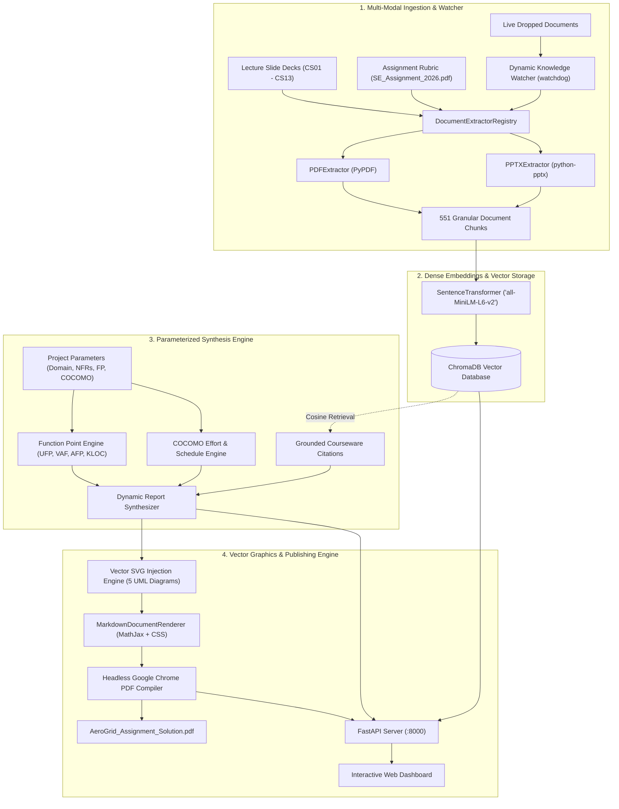

# Academic RAG Architecture & Implementation Blueprint

> **Course**: SE ZG343 Software Engineering (BITS Pilani WILP)  
> **Author**: Arabindaksha Mishra (`mishraarabinda02@gmail.com`)  
> **Target Objective**: Build an end-to-end multi-modal Retrieval-Augmented Generation (RAG) platform, dynamic sizing engine, and automated publication pipeline for software engineering specifications.

---

## 1. System Overview & Architecture Diagram

The **Academic RAG Synthesis Engine** ingests heterogeneous academic course materials (13 lecture PDF/PPT slide decks and assignment rubrics), performs slide-aware semantic chunking, and indexes them into an in-memory/persisted **ChromaDB** vector store using dense sentence embeddings (`all-MiniLM-L6-v2`).

It provides **task-routed semantic retrieval**, a **parameterized mathematical sizing engine**, a **live document watcher**, and an **interactive FastAPI dashboard** to generate high-fidelity, grounded deliverables.




---

## 2. Ingestion & Multi-Modal Parsing Pipeline

### 2.1 Decoupled Strategy Pattern
Document extraction is designed using the **Strategy Pattern** ([src/data_parser.py](file:///usr/local/google/home/arabindaksha/academic-rag-synthesis-engine/src/data_parser.py)):
* `BaseDocumentExtractor` (ABC): Defines `can_handle(file_path)` and `extract_chunks(...)`.
* `PDFExtractor`: Extracts textual streams page-by-page from PDF files using `pypdf`.
* `PPTXExtractor`: Traverses the shape hierarchy in PowerPoint presentations to extract text frames, bullet runs, and slide titles using `python-pptx`.
* `DocumentExtractorRegistry`: Orchestrates registered extractors with automatic multi-format fallback (e.g. handling PPTX files saved with a `.pdf` extension).

### 2.2 Semantic Boundary Chunking
Instead of arbitrary fixed-character windowing, chunks are aligned with document semantic boundaries:
* **Chunk Boundary**: 1 Lecture Slide / 1 Specification Section.
* **Minimum Length Filter**: 25 characters to ignore blank slides or layout artifacts.
* **Structured Metadata**:
  ```python
  {
      "source": "CS05_UnderstandingRequirements.pdf",
      "slide_or_page": 25,
      "doc_type": "pdf_document"
  }
  ```
* **Total Knowledge Chunks Indexed**: **551 Granular Chunks**.

---

## 3. Embedding Space & ChromaDB Vector Store

* **Dense Embedding Model**: `sentence-transformers/all-MiniLM-L6-v2` (384-dimensional dense vectors, lightweight inference $< 50\text{ ms}$).
* **Vector Store**: **ChromaDB** (`chromadb.Client()`) in-memory or persisted locally.
* **Distance Metric**: Cosine Similarity ($1 - \text{cosine\_distance}$).
* **Collection Name**: `se_academic_knowledge_base`.

---

## 4. Multi-Stage Task Routing & Semantic Grounding

The engine maps natural language queries to curriculum lecture topics to ground each assignment deliverable:

| Assignment Deliverable | Knowledge Source Files | Grounded Curriculum Topics |
| :--- | :--- | :--- |
| **Task 1: SRS (IEEE 830)** | `CS05_UnderstandingRequirements.pdf`, `CS01` | IEEE 830 standard template, functional requirement specifications, measurable NFR metrics (p99 latency, availability). |
| **Task 2: Behavioral Modeling** | `CS06_AnalysisModel.pdf` | UML Use Case relationships (`«include»`, `«extend»`), Activity Diagrams, dynamic load balancing workflows. |
| **Task 3: 4+1 View Architecture** | `CS-08__Architectural Design.pdf`, `CS09` | 4+1 Architectural View Model, Logical View Class Diagrams, Event-Driven Microservices vs Monolithic Architecture. |
| **Task 4: Project Estimation** | `CS12_SoftwareTestingProcess.pdf`, `CS02` | Function Point Analysis (UFP, VAF, AFP), Basic COCOMO formulas ($a=3.0, b=1.12$ for Semidetached). |

---

## 5. Parameterized Sizing & Synthesis Engine

The synthesis engine ([src/synthesis_engine.py](file:///usr/local/google/home/arabindaksha/academic-rag-synthesis-engine/src/synthesis_engine.py)) computes metrics dynamically:

### Function Point Analysis (IFPUG)
$$\text{UFP} = (EI \times 4) + (EO \times 5) + (EQ \times 4) + (ILF \times 10) + (EIF \times 7)$$
$$\text{VAF} = 0.65 + \left(0.01 \times \sum TDI\right)$$
$$\text{AFP} = \text{UFP} \times \text{VAF}$$
$$\text{Derived KLOC} = \frac{\text{AFP} \times \text{LOC/FP}}{1000}$$

### Basic COCOMO Estimation
$$\text{Effort (Person-Months)} = a \times (\text{KLOC})^b$$
$$\text{Development Time (Months)} = c \times (\text{Effort})^d$$
$$\text{Staff Size} = \frac{\text{Effort}}{\text{Development Time}}$$

---

## 6. Vector SVG Graphics & Headless Chrome Publishing

1. **Vector SVG Library** ([src/vector_svgs.py](file:///usr/local/google/home/arabindaksha/academic-rag-synthesis-engine/src/vector_svgs.py)): Generates pure vector SVGs for System Context, Use Case, Activity, Class, and Microservices architectures with crisp resolution.
2. **Markdown AST & MathJax Renderer** ([src/utils.py](file:///usr/local/google/home/arabindaksha/academic-rag-synthesis-engine/src/utils.py)): Converts Markdown to HTML5, binds responsive CSS typography, and loads MathJax for LaTeX mathematical equations.
3. **Headless Chrome PDF Compiler**: Invokes `google-chrome --headless=new --print-to-pdf` with a `--virtual-time-budget=9000` to guarantee complete MathJax rendering before PDF generation.

---

## 7. Dynamic File Watcher & REST API

* **Live Watcher Daemon** ([src/watcher.py](file:///usr/local/google/home/arabindaksha/academic-rag-synthesis-engine/src/watcher.py)): Employs `watchdog` to monitor `knowledge_base/` and incrementally index newly dropped PDFs/PPTXs into ChromaDB in real time.
* **FastAPI Server** ([src/api_server.py](file:///usr/local/google/home/arabindaksha/academic-rag-synthesis-engine/src/api_server.py)): Exposes REST endpoints (`/api/query`, `/api/upload`, `/api/generate-report`, `/api/download/{filename}`) and serves an interactive web dashboard at `http://localhost:8000/`.

---
*Academic RAG Synthesis Engine Architecture — BITS Pilani WILP Coursework Engine.*
