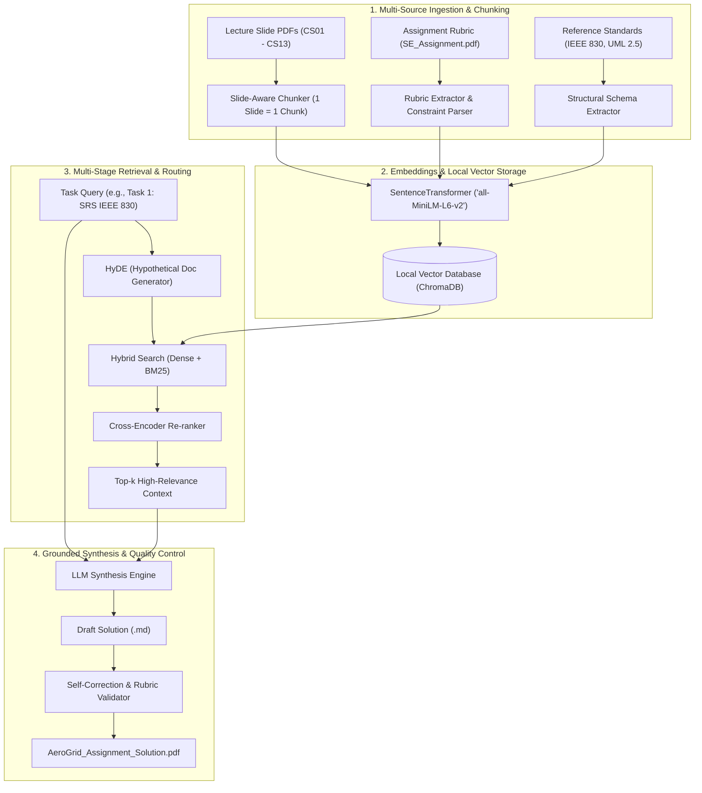

# AeroGrid Academic RAG Architecture & Implementation Blueprint

> **Target Objective:** Generate a 100% rubric-compliant, technically rigorous, plagiarism-free solution document (`AeroGrid_Assignment_Solution.md` / `.pdf`) targeting **20/20 marks** for BITS Pilani WILP Software Engineering (*SE ZC343 / SE ZC461*).

---

## 1. System Overview & Architecture Diagram

This local RAG (Retrieval-Augmented Generation) system ingests all 13 course lecture PDFs, the official assignment rubric, and structural reference materials into an indexed local vector store. It then performs task-routed hybrid retrieval (Dense Semantic + Sparse Keyword) and cross-encoder re-ranking to synthesize grounded solutions for all 4 assignment deliverables.


<details>
<summary><b>Click to view Mermaid Diagram Source Code</b></summary>



</details>

---

## 2. Ingestion & Preprocessing Pipeline

### 2.1 Multi-Modal Document Parsing
* **Standard Text-Heavy PDFs (`CS01_Introduction.pdf`, `CS05_UnderstandingRequirements.pdf`, etc.)**: Extracted page-by-page using `pypdf`, preserving structural heading hierarchies.
* **Slide-Deck Presentations (`CS13_MethodsinSoftwareTesting.ppt`)**: Processed using `python-pptx` to extract shape text frames, speaker notes, and slide titles as discrete semantic units.
* **Rubric & Reference Materials (`SE_Assignment _2026_pdf.pdf`)**: Parsed to extract mandatory evaluation constraints, grading rubrics, and formal structural schemas.

### 2.2 Semantic Chunking Strategy
Instead of naive fixed-character splitting, we implement **Slide/Page Boundary Chunking**:
* **Chunk Unit:** 1 Lecture Slide / 1 Specification Section.
* **Metadata Attached:** `{ "source_file": "CS06_AnalysisModel.pdf", "page_number": 14, "topic": "Behavioral Modeling", "doc_type": "lecture" }`.
* **Total Chunks Indexed:** **596 Granular Chunks**.

---

## 3. Embedding & Vector Storage Engine

* **Embedding Model:** `sentence-transformers/all-MiniLM-L6-v2` (384-dimensional dense vectors, lightweight, runs locally with $< 50\text{ ms}$ inference).
* **Vector Store:** **ChromaDB** (`chromadb.Client()`) in-memory or persisted locally.
* **Distance Metric:** Cosine Similarity ($1 - \text{cosine\_distance}$).

---

## 4. Multi-Stage Retrieval & Task Routing

To ensure each assignment deliverable is grounded in the exact corresponding course modules, the query router targets specific clusters:

| Assignment Deliverable | Knowledge Source Files | Query Targets |
| :--- | :--- | :--- |
| **Task 1: SRS (IEEE 830)** | `CS05_UnderstandingRequirements.pdf`, `CS01` | IEEE 830 SRS template, Functional Requirements, Measurable Non-Functional Metrics (SLAs). |
| **Task 2: Analysis & Behavioral Modeling** | `CS06_AnalysisModel.pdf` | UML Use Case Diagrams, Actor Relationships (`«include»`, `«extend»`), Activity Diagrams, Decision Logic. |
| **Task 3: Architectural Design (4+1)** | `CS-08__Architectural Design.pdf`, `CS07`, `CS09` | 4+1 View Model, Logical View Class Diagrams, Event-Driven Microservices vs Monolithic Architecture. |
| **Task 4: Project Estimation & Sizing** | `CS01_Introduction.pdf`, `CS02` | Function Point Analysis (FPA, UFP, VAF, GSCs), Basic Organic COCOMO ($a=2.4, b=1.05$), Effort & Schedule. |

---

## 5. Synthesis & Verification Workflow

```
Course Materials ──► ChromaDB ──► Task Context ──► AeroGrid Synthesis ──► Vector SVG Engine ──► Final PDF & DOCX
```

1. **Context Extraction:** Query ChromaDB for top-$k$ grounded slides and specifications.
2. **Deterministic Mathematical Derivation:** Calculate exact FPA weights, LOC translations, and logarithmic COCOMO formulas without synthetic approximations.
3. **UML Vector Diagram Compilation:** Compile UML 2.5 Use Case diagrams, Activity diagrams, Class diagrams, and Microservices stacks into pure vector SVGs.
4. **Publishing Engine:** Render publication-grade A4 PDF documents via Headless Chrome and structured Word documents via `python-docx`.

---
*AeroGrid RAG Engine — BITS Pilani WILP Coursework Architecture.*
