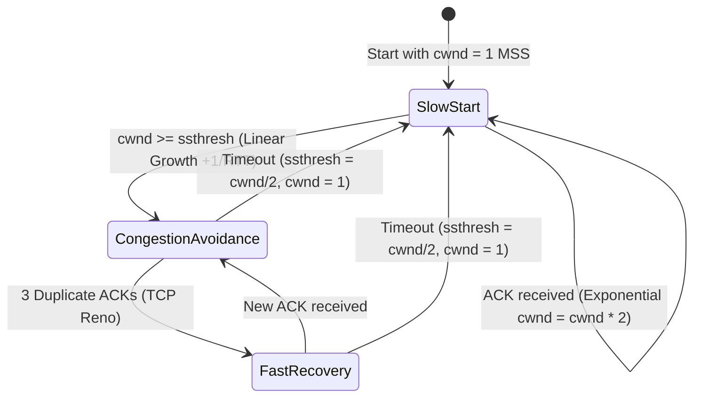

# BITS WILP Computer Networks (BSDCBZC481 / BITS ZC481)
## Comprehensive Exam Master Preparation Guide & Open-Book Cheat Sheet

> [!IMPORTANT]
> **EXAM FORMAT & SCORING PRINCIPLE (OPEN-BOOK EXAM)**
> In BITS WILP Computer Networks exams, open-book questions do **NOT** ask for direct definitions or descriptive theory. Examiners test:
> 1. **Mathematical & Algorithmic Protocol Modeling**: Subnetting, Dijkstra, Bellman-Ford, CRC, Nodal Delays.
> 2. **Packet Tracing & State Transitions**: TCP cwnd window evolution, Fragmentation tables, ARP/Switch learning.
> 3. **Protocol Comparative Trade-offs**: GBN vs Selective Repeat, Leaky Bucket vs Token Bucket, Tahoe vs Reno.
>
> **Weightage Split**: Because you completed your Mid-Sem ~3 months ago, the Comprehensive Exam focuses **~65% on Post-Midsem topics (Sessions 08–15)** and **~35% on High-Yield Pre-Midsem topics (Sessions 01–07)**.

---

## 0. Essential Prerequisites & Mental Models (Exam Foundation)

Before starting the derivations and blueprints, keep these 4 core foundations in mind:

### 0.1 The 3 Levels of Addressing
```
[ Application Layer ] --> Message (HTTP, DNS)
       |
[ Transport Layer ]   --> Segment: PORT NUMBER (16 bits) -> Identifies the specific PROCESS / APP
       |
[ Network Layer ]     --> Datagram: IP ADDRESS (32 bits)  -> Identifies the specific HOST (End-to-End)
       |
[ Link Layer ]        --> Frame: MAC ADDRESS (48 bits)    -> Identifies physical NIC for ONE HOP on local wire
```
* **Host-to-Host vs. Process-to-Process**: The Network Layer is responsible for **Host-to-Host** delivery across intermediate routers. The Transport Layer provides **Process-to-Process** communication between client and server applications.

### 0.2 Data Plane vs. Control Plane (Forwarding vs. Routing)
- **Forwarding (Data Plane - Session 10)**: The local, hardware action inside a single router that transfers an incoming packet from an input link interface to the appropriate output link interface in nanoseconds.
- **Routing (Control Plane - Session 11)**: The network-wide logic (Dijkstra, Bellman-Ford, OSPF, BGP) that computes the end-to-end paths taken by packets from source to destination and builds the forwarding tables.

### 0.3 Magic Subnetting Tables (Powers of 2 & Subnet Masks)
You only need to know these two tables to solve any subnetting question without hesitation:

#### Table A: Powers of 2 & Usable Hosts ($2^h - 2$)
| Host Bits ($h$) | $2^h$ Block Size | Usable Hosts ($2^h - 2$) | Typical Subnet Use |
| :---: | :---: | :---: | :--- |
| **2** | 4 | **2** | Point-to-Point WAN router link (`/30`) |
| **3** | 8 | **6** | Small sub-branch (`/29`) |
| **4** | 16 | **14** | Small department (`/28`) |
| **5** | 32 | **30** | Medium department (`/27`) |
| **6** | 64 | **62** | Large department (`/26`) |
| **7** | 128 | **126** | Enterprise campus floor (`/25`) |
| **8** | 256 | **254** | Standard Class C block (`/24`) |

#### Table B: The 8 Subnet Mask Octet Values
Whenever bits are borrowed for a subnet, the last octet in decimal is always one of these:
```
1 bit borrowed:  10000000 = 128  (/25)
2 bits borrowed: 11000000 = 192  (/26)
3 bits borrowed: 11100000 = 224  (/27)
4 bits borrowed: 11110000 = 240  (/28)
5 bits borrowed: 11111000 = 248  (/29)
6 bits borrowed: 11111100 = 252  (/30  -> WAN links)
7 bits borrowed: 11111110 = 254  (/31)
8 bits borrowed: 11111111 = 255  (/32  -> Host route)
```

### 0.4 MTU & The 8-Byte Divisibility Rule
- **MTU (Maximum Transmission Unit)**: Maximum frame payload size enforced by physical media (standard Ethernet = 1,500 bytes).
- **The 8-Byte Rule**: The **Fragment Offset** field in the IPv4 header is only 13 bits wide. To map up to 65,535 bytes, the offset is measured in **8-byte (64-bit) units**.
  $$\text{Fragment Offset} = \frac{\text{Byte Position of First Data Byte in Fragment}}{8}$$
  Therefore, every fragment's data payload (except the final fragment) **must be a strict multiple of 8 bytes**.

---

## 1. Lecture-by-Lecture Weightage & Priority Matrix

Use this matrix to prioritize your immediate review before walking into the exam room. The slide deck column points directly to your printout files in [`sessionwise_lectures`](file:///usr/local/google/home/arabindaksha/Modify-pdf/exam_ready_pdf_modules/2_Computer_Networks_BSDCBZC481/sessionwise_lectures).

| Session & Topic | Corresponding PDF Deck | Exam Weightage | Priority Tier | Likely Question Types |
| :--- | :--- | :---: | :---: | :--- |
| **Session 10: Network Layer (IP Addressing, Subnetting, NAT, Fragmentation)** | [`Session_10_Network_Layer_IP_Addressing_NAT.pdf`](file:///usr/local/google/home/arabindaksha/Modify-pdf/exam_ready_pdf_modules/2_Computer_Networks_BSDCBZC481/sessionwise_lectures/Session_10_Network_Layer_IP_Addressing_NAT.pdf) | **18% – 22%** | **Tier 1 (Highest)** | **Guaranteed 10–12 Mark Numerical**: VLSM Subnetting table OR IPv4 Fragmentation Offset calculation. |
| **Session 11: Network Layer (Routing Algorithms: Dijkstra & Bellman-Ford)** | [`Session_11_Network_Layer_Routing_Algorithms.pdf`](file:///usr/local/google/home/arabindaksha/Modify-pdf/exam_ready_pdf_modules/2_Computer_Networks_BSDCBZC481/sessionwise_lectures/Session_11_Network_Layer_Routing_Algorithms.pdf) | **15% – 20%** | **Tier 1 (Highest)** | **Guaranteed 10–15 Mark Problem**: Step-by-step Dijkstra shortest path table or Bellman-Ford distance vector iterations + Count-to-Infinity. |
| **Session 08: Transport Layer (TCP Congestion Control)** | [`Session_08_Transport_Layer_TCP_Congestion.pdf`](file:///usr/local/google/home/arabindaksha/Modify-pdf/exam_ready_pdf_modules/2_Computer_Networks_BSDCBZC481/sessionwise_lectures/Session_08_Transport_Layer_TCP_Congestion.pdf) | **12% – 15%** | **Tier 1 (Highest)** | **Guaranteed Numerical/Graph**: Tracing `cwnd` & `ssthresh` over rounds (Slow Start, Congestion Avoidance, Tahoe vs Reno reaction). |
| **Session 12: Link Layer & LANs (Framing, CRC, Ethernet, Switches)** | [`Session_12_Link_Layer_LANs_and_Ethernet.pdf`](file:///usr/local/google/home/arabindaksha/Modify-pdf/exam_ready_pdf_modules/2_Computer_Networks_BSDCBZC481/sessionwise_lectures/Session_12_Link_Layer_LANs_and_Ethernet.pdf) | **12% – 15%** | **Tier 1 (Highest)** | **Guaranteed Numerical/Trace**: CRC Modulo-2 polynomial division OR Switch self-learning table forwarding/filtering. |
| **Session 06 & 07: Transport Layer (RDT, TCP Structure & Handshake)** | [`Session_06_Transport_Layer_UDP_and_RDT.pdf`](file:///usr/local/google/home/arabindaksha/Modify-pdf/exam_ready_pdf_modules/2_Computer_Networks_BSDCBZC481/sessionwise_lectures/Session_06_Transport_Layer_UDP_and_RDT.pdf) / [`Session_07`](file:///usr/local/google/home/arabindaksha/Modify-pdf/exam_ready_pdf_modules/2_Computer_Networks_BSDCBZC481/sessionwise_lectures/Session_07_Transport_Layer_TCP_Structure.pdf) | **10% – 12%** | **Tier 2 (High)** | GBN vs Selective Repeat window bounds ($2^{k-1}$), TCP 3-way Handshake sequence/ACK tracking, Flow control (`rwnd`). |
| **Session 02: Network Edge, Core & Delays** | [`Session_02_Network_Edge_Core_and_Switching.pdf`](file:///usr/local/google/home/arabindaksha/Modify-pdf/exam_ready_pdf_modules/2_Computer_Networks_BSDCBZC481/sessionwise_lectures/Session_02_Network_Edge_Core_and_Switching.pdf) | **8% – 10%** | **Tier 2 (High)** | Transmission vs Propagation delay calculations ($d_{trans} = L/R$, $d_{prop} = d/s$), total nodal delay, packet switching vs circuit switching. |
| **Session 13 & 14: Wireless & Security** | [`Session_13`](file:///usr/local/google/home/arabindaksha/Modify-pdf/exam_ready_pdf_modules/2_Computer_Networks_BSDCBZC481/sessionwise_lectures/Session_13_Wireless_and_Mobile_Networks.pdf) / [`Session_14`](file:///usr/local/google/home/arabindaksha/Modify-pdf/exam_ready_pdf_modules/2_Computer_Networks_BSDCBZC481/sessionwise_lectures/Session_14_Network_Security_Cryptography.pdf) | **8% – 10%** | **Tier 2 (Medium)** | Hidden/Exposed terminal RTS/CTS exchange, RSA numerical ($e \cdot d \equiv 1 \pmod{\phi(n)}$), Symmetric vs Asymmetric crypto. |
| **Session 01, 04, 05, 09, 15: Concepts & QoS** | [`Session_01`](file:///usr/local/google/home/arabindaksha/Modify-pdf/exam_ready_pdf_modules/2_Computer_Networks_BSDCBZC481/sessionwise_lectures/Session_01_Intro_and_Network_Models.pdf), [`04`](file:///usr/local/google/home/arabindaksha/Modify-pdf/exam_ready_pdf_modules/2_Computer_Networks_BSDCBZC481/sessionwise_lectures/Session_04_App_Layer_Web_HTTP_DNS.pdf), [`05`](file:///usr/local/google/home/arabindaksha/Modify-pdf/exam_ready_pdf_modules/2_Computer_Networks_BSDCBZC481/sessionwise_lectures/Session_05_App_Layer_P2P_and_Sockets.pdf), [`09`](file:///usr/local/google/home/arabindaksha/Modify-pdf/exam_ready_pdf_modules/2_Computer_Networks_BSDCBZC481/sessionwise_lectures/Session_09_Network_Layer_Data_Plane_Routers.pdf), [`15`](file:///usr/local/google/home/arabindaksha/Modify-pdf/exam_ready_pdf_modules/2_Computer_Networks_BSDCBZC481/sessionwise_lectures/Session_15_Multimedia_Networks_and_Review.pdf) | **5% – 8%** | **Tier 3 (Lookup)** | Direct PPT lookups: Leaky Bucket vs Token Bucket, HTTP 1.0 vs 1.1 vs 2.0, DNS hierarchy, Router HOL blocking. |

---

## 2. Emergency 3-Hour Study Schedule

```mermaid
gantt
    title 3-Hour Emergency Exam Plan
    dateFormat X
    axisFormat %s min
    section Core Numericals
    VLSM Subnetting (Session 10) :0, 25
    Dijkstra Shortest Path (Session 11) :25, 50
    CRC Polynomial Division (Session 12) :50, 75
    section Protocol Traces
    TCP Congestion Trace (Session 08) :75, 105
    IPv4 Fragmentation Offset (Session 10) :105, 130
    Switch Learning & Delays (Session 02, 12) :130, 155
    section Printout Prep
    Tab PPT Decks with Sticky Notes :155, 180
```



---

## 3. Master Numerical Blueprints (With Step-by-Step Templates)

### Blueprint 1: Variable Length Subnet Masking (VLSM)
> **Crucial Rule**: Always sort subnet requirements in **descending order** (largest host requirement first).

#### 4-Step Algorithm:
1. **Sort Demands**: Largest subnet $\rightarrow$ Smallest subnet.
2. **Compute Host Bits ($H$)**:
   $$2^H - 2 \ge \text{Hosts Needed}$$
   *(Note: Subtract 2 for Network ID and Broadcast Address).*
3. **Compute Subnet Prefix**:
   $$\text{Prefix Length} = 32 - H$$
4. **Compute Block Size (Increment)**:
   $$\text{Block Size} = 2^H$$
   Next Subnet Network ID = $\text{Current Network ID} + 2^H$.

#### Worked Exam Example:
**Problem**: Subnet `192.168.1.0/24` for: Dept A (50 hosts), Dept B (25 hosts), Dept C (10 hosts), WAN Link (2 hosts).

| Subnet | Hosts Needed | Formula: $2^H - 2 \ge N$ | Host Bits ($H$) | Prefix ($32-H$) | Subnet Mask | Subnet Network ID | Usable Host Range | Broadcast IP |
| :--- | :---: | :---: | :---: | :---: | :--- | :--- | :--- | :--- |
| **Dept A** | 50 | $2^6 - 2 = 62 \ge 50$ | 6 | `/26` | `255.255.255.192` | **192.168.1.0/26** | `192.168.1.1` – `192.168.1.62` | `192.168.1.63` |
| **Dept B** | 25 | $2^5 - 2 = 30 \ge 25$ | 5 | `/27` | `255.255.255.224` | **192.168.1.64/27** | `192.168.1.65` – `192.168.1.94` | `192.168.1.95` |
| **Dept C** | 10 | $2^4 - 2 = 14 \ge 10$ | 4 | `/28` | `255.255.255.240` | **192.168.1.96/28** | `192.168.1.97` – `192.168.1.110` | `192.168.1.111` |
| **WAN** | 2 | $2^2 - 2 = 2 \ge 2$ | 2 | `/30` | `255.255.255.252` | **192.168.1.112/30** | `192.168.1.113` – `192.168.1.114` | `192.168.1.115` |

---

### Blueprint 2: IPv4 Fragmentation & Fragment Offset
> **Crucial Rule**: Fragment Offset is expressed in **8-byte units** (i.e. $\text{byte offset} / 8$). Payload data per fragment MUST be a multiple of 8.

#### Key Parameters:
- **IP Header**: Default is $20\text{ bytes}$ (unless options are specified).
- **Max Data Payload per Fragment**:
  $$\text{Max Payload} = \left\lfloor \frac{\text{MTU} - 20}{8} \right\rfloor \times 8$$
- **Flags**:
  - `DF` (Don't Fragment): $0$ allows fragmentation, $1$ drops packet if size > MTU.
  - `MF` (More Fragments): $1$ for all intermediate fragments; $0$ for the final fragment.

#### Worked Exam Example:
**Problem**: An IPv4 datagram of $3500\text{ bytes}$ (including $20\text{ bytes}$ IP header $\rightarrow 3480\text{ bytes}$ data) traverses a link with $\text{MTU} = 1500\text{ bytes}$.

- Max data payload per fragment = $\lfloor (1500 - 20) / 8 \rfloor \times 8 = 1480\text{ bytes}$.
- Fragments needed: $3480 / 1480 \rightarrow 1480 + 1480 + 520$.

| Fragment # | Total Length | Data Length | Data Range | Flag: DF | Flag: MF | Fragment Offset ($\text{Data Start} / 8$) |
| :---: | :---: | :---: | :---: | :---: | :---: | :---: |
| **Frag 1** | $1500\text{ B}$ | $1480\text{ B}$ | Bytes $0$ to $1479$ | 0 | 1 | $0 / 8 = \mathbf{0}$ |
| **Frag 2** | $1500\text{ B}$ | $1480\text{ B}$ | Bytes $1480$ to $2959$ | 0 | 1 | $1480 / 8 = \mathbf{185}$ |
| **Frag 3** | $540\text{ B}$ | $520\text{ B}$ | Bytes $2960$ to $3479$ | 0 | 0 | $2960 / 8 = \mathbf{370}$ |

---

### Blueprint 3: Dijkstra’s Link-State Shortest Path Algorithm
> **Table Structure**: $N'$ (set of nodes permanently decided), and columns $D(v), p(v)$ for each destination node.

#### Step-by-Step Procedure:
1. **Step 0**: Set $N' = \{u\}$ (source node). For direct neighbors $v$, $D(v) = c(u,v), u$. For non-neighbors, $D(v) = \infty$.
2. **Find Minimum**: Find $w \notin N'$ such that $D(w)$ is minimum.
3. **Add to $N'$**: Add $w$ to $N'$.
4. **Update**: For each neighbor $v \notin N'$ of $w$:
   $$D(v) = \min(D(v), D(w) + c(w,v))$$
   If updated, record $p(v) = w$.
5. Repeat until all nodes are in $N'$.

---

### Blueprint 4: Cyclic Redundancy Check (CRC)
> **Rule**: For a generator polynomial $G(x)$ of degree $k$, append $k$ zeros to the data $D$. Then perform Modulo-2 binary division (using XOR for subtraction).

#### Worked Exam Example:
- **Data bits ($D$)**: `101001`
- **Generator ($G$)**: $x^3 + x^2 + 1 \rightarrow \mathbf{1101}$ (Degree $k = 3$)
- **Appended Data**: Append $3$ zeros $\rightarrow \mathbf{101001000}$
- **Modulo-2 Division**:
  ```text
            111101  (Quotient)
  1101 | 101001000
         1101
         ----
          1110
          1101
          ----
           0111
           0000
           ----
            1110
            1101
            ----
             0110
             0000
             ----
              1100
              1101
              ----
               0010  --> Remainder R = 010 (3 bits)
  ```
- **Transmitted Codeword**: $[D][R] = \mathbf{101001010}$.
- **Receiver Check**: Divide `101001010` by `1101`. If remainder is `000`, transmission is error-free.

---

### Blueprint 5: TCP Congestion Control Trace (Tahoe vs Reno)



#### The Exact Rules:
1. **Slow Start**: $cwnd$ starts at $1\text{ MSS}$. Doubles every RTT ($1 \rightarrow 2 \rightarrow 4 \rightarrow 8$) until $cwnd \ge ssthresh$.
2. **Congestion Avoidance**: Starts when $cwnd \ge ssthresh$. Increases linearly by $+1\text{ MSS}$ each RTT.
3. **Event 1: Loss detected via TIMEOUT**:
   - **Both Tahoe and Reno**: $ssthresh = \lfloor cwnd / 2 \rfloor$, $cwnd = 1\text{ MSS}$. Return to Slow Start.
4. **Event 2: Loss detected via 3 DUPLICATE ACKs**:
   - **TCP Tahoe**: $ssthresh = \lfloor cwnd / 2 \rfloor$, $cwnd = 1\text{ MSS}$ (Slow Start).
   - **TCP Reno (Fast Retransmit & Fast Recovery)**:
     $$ssthresh = \lfloor cwnd / 2 \rfloor, \quad cwnd = ssthresh + 3\text{ MSS}$$
     Upon receiving the expected new ACK, $cwnd = ssthresh$ and resumes linear growth in Congestion Avoidance!

---

### Blueprint 6: Link-Layer Switch Self-Learning Table
> **Switch Rule**: When a frame with Source MAC $S$ and Destination MAC $D$ arrives on Port $x$:
> 1. **Learn**: Insert or refresh entry `(S, x, current_timestamp)` in the switch table.
> 2. **Check Destination $D$**:
>    - If $D$ is in table on Port $y$:
>      - If $y == x$: **Filter / Drop** (destination is on the same physical segment).
>      - If $y \ne x$: **Forward** selectively to Port $y$.
>    - If $D$ is NOT in table (or is broadcast `FF:FF:FF:FF:FF:FF`): **Flood** out of all ports except incoming port $x$.

---

## 4. Key Protocol Comparison Cheat Sheet

| Feature | Go-Back-N (GBN) | Selective Repeat (SR) |
| :--- | :--- | :--- |
| **Sender Window Size ($W$)** | $W \le 2^k - 1$ | $W \le 2^{k-1}$ |
| **Receiver Window Size** | Exactly $1$ | Exactly equal to Sender Window $W$ |
| **ACK Type** | Cumulative ACK (ACK $n$ confirms all packets up to $n$) | Individual / Selective ACK for each frame |
| **Buffer at Receiver** | Discards out-of-order packets (no buffer) | Buffers out-of-order packets |
| **On Timeout** | Retransmits ALL unacknowledged packets in window | Retransmits ONLY the specific timed-out packet |

| Feature | Leaky Bucket | Token Bucket |
| :--- | :--- | :--- |
| **Output Rate** | Strictly constant / smooth rate | Allows bursts up to the token capacity |
| **Token Mechanism** | No tokens (packets leak at constant rate $r$) | Tokens accumulate at rate $r$ up to capacity $b$ |
| **Packet Loss** | Packets drop when bucket buffer is full | Packets drop or queue when no tokens are available |
| **Bursty Traffic** | Completely eliminates burstiness | Permits controlled bursts of size $b + r \cdot t$ |

| Protocol | Type | Algorithm | Metric | Scope | Loop Prevention |
| :--- | :--- | :--- | :--- | :--- | :--- |
| **RIP** | Distance Vector | Bellman-Ford | Hop count (max 15; 16 = $\infty$) | Intra-AS | Split Horizon & Poisoned Reverse |
| **OSPF** | Link State | Dijkstra | Cost (bandwidth-based) | Intra-AS | Full link-state topology visibility |
| **BGP-4** | Path Vector | Policy-based | AS-PATH list & Next-Hop | Inter-AS | AS loop detection in `AS-PATH` |

---

## 5. Physical Printout Tabbing Guide

Before heading to the exam hall, place sticky tabs on your printed slides matching these exact lecture files:

- **[TAB 1] Subnetting & Fragmentation**: Turn to [`Session_10_Network_Layer_IP_Addressing_NAT.pdf`](file:///usr/local/google/home/arabindaksha/Modify-pdf/exam_ready_pdf_modules/2_Computer_Networks_BSDCBZC481/sessionwise_lectures/Session_10_Network_Layer_IP_Addressing_NAT.pdf).
- **[TAB 2] Routing Algorithms**: Turn to [`Session_11_Network_Layer_Routing_Algorithms.pdf`](file:///usr/local/google/home/arabindaksha/Modify-pdf/exam_ready_pdf_modules/2_Computer_Networks_BSDCBZC481/sessionwise_lectures/Session_11_Network_Layer_Routing_Algorithms.pdf).
- **[TAB 3] TCP Congestion & Reno**: Turn to [`Session_08_Transport_Layer_TCP_Congestion.pdf`](file:///usr/local/google/home/arabindaksha/Modify-pdf/exam_ready_pdf_modules/2_Computer_Networks_BSDCBZC481/sessionwise_lectures/Session_08_Transport_Layer_TCP_Congestion.pdf).
- **[TAB 4] CRC & LAN Switching**: Turn to [`Session_12_Link_Layer_LANs_and_Ethernet.pdf`](file:///usr/local/google/home/arabindaksha/Modify-pdf/exam_ready_pdf_modules/2_Computer_Networks_BSDCBZC481/sessionwise_lectures/Session_12_Link_Layer_LANs_and_Ethernet.pdf).
- **[TAB 5] Transmission / Propagation Delay**: Turn to [`Session_02_Network_Edge_Core_and_Switching.pdf`](file:///usr/local/google/home/arabindaksha/Modify-pdf/exam_ready_pdf_modules/2_Computer_Networks_BSDCBZC481/sessionwise_lectures/Session_02_Network_Edge_Core_and_Switching.pdf).
- **[TAB 6] Master Companion PDF**: You can also reference [2_Computer_Networks_Open_Book_Companion.pdf](file:///usr/local/google/home/arabindaksha/Downloads/2_Computer_Networks_Open_Book_Companion.pdf).

---

## 6. Curated Topic-Wise YouTube Video Quick-Reference

Watch these on **1.5× or 1.75× speed** for rapid numerical concept reinforcement:

| Session | Core Topic | Recommended Video Link | Duration & Source |
| :---: | :--- | :--- | :---: |
| **S10** | **Subnetting & VLSM Shortcuts** | [Gate Smashers – Subnetting Made Easy](https://www.youtube.com/watch?v=1Zx2nI03n-Q) | ~12 mins (Varun Singla) |
| **S10** | **IPv4 Packet Fragmentation** | [Gate Smashers – IPv4 Datagram Fragmentation](https://www.youtube.com/watch?v=R9j7P7Gj434) | ~11 mins (Solved Problem) |
| **S10** | **DHCP (The 4-Step DORA Exchange)** | [Gate Smashers – DHCP Protocol Working](https://www.youtube.com/watch?v=kYyO1d5e3oE) | ~9 mins (Port 67/68) |
| **S10** | **NAT (Port Translation Tables)** | [Gate Smashers – Network Address Translation](https://www.youtube.com/watch?v=rd57p8u8w6U) | ~10 mins (NAPT) |
| **S11** | **Dijkstra’s Shortest Path Algorithm** | [Abdul Bari – Dijkstra's Algorithm Step-by-Step](https://www.youtube.com/watch?v=XB4MIexqxYo) | ~16 mins (Abdul Bari) |
| **S11** | **Bellman-Ford / Distance Vector** | [Abdul Bari – Bellman-Ford Algorithm](https://www.youtube.com/watch?v=lyw4FaxrwHg) | ~18 mins (Abdul Bari) |
| **S08** | **TCP Congestion Control (Tahoe vs Reno)** | [Gate Smashers – AIMD, Tahoe & Reno Trace](https://www.youtube.com/watch?v=kYv-Fj82P5w) | ~13 mins (Window Graph) |
| **S12** | **CRC (Cyclic Redundancy Check) Division** | [Gate Smashers – CRC Generation & Check](https://www.youtube.com/watch?v=kU8Y1L2f7nQ) | ~12 mins (XOR Division) |
| **S06** | **Go-Back-N (GBN) Sliding Window** | [Gate Smashers – Go-Back-N Protocol](https://www.youtube.com/watch?v=A-tV4-3V7cE) | ~14 mins (Timer & Window) |
| **All** | **Primary Textbook Author Lecture Playlists** | [Jim Kurose Official Video Lecture Series](https://www.youtube.com/@JimKurose/playlists) | Full Archive (Kurose & Ross) |
