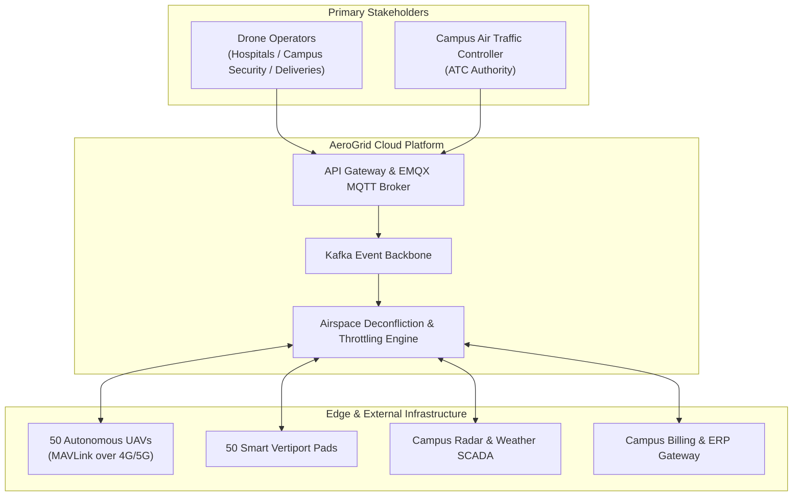
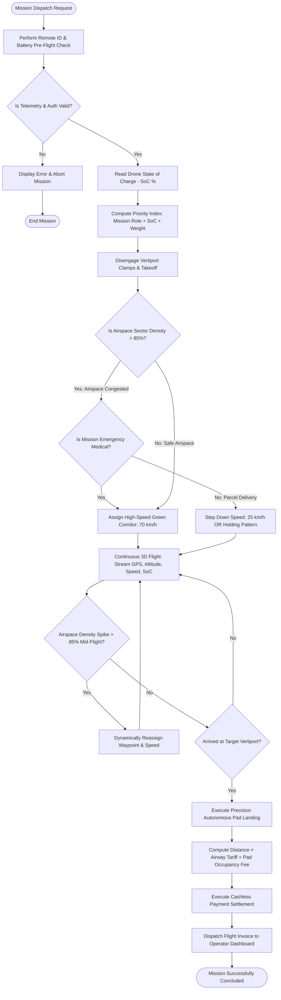
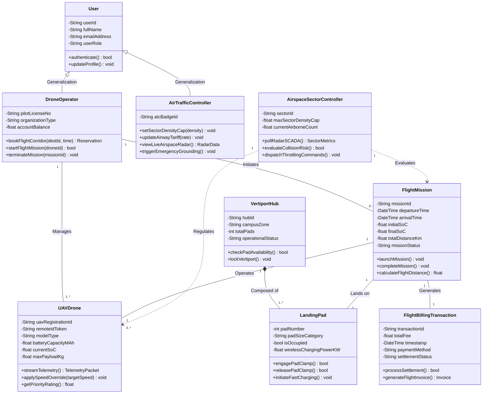
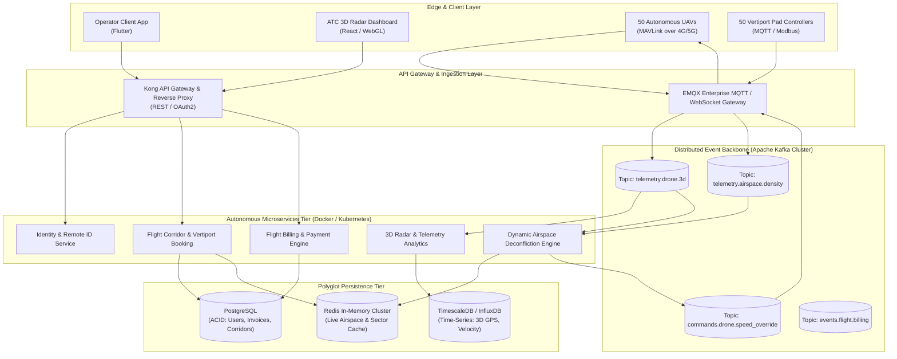

# Software Engineering
## Assignment
**Name:** Arabindaksha Mishra  
**ID:** 202217b4513  

---

### 1. OBJECTIVE
The objective is to Translate real-world business challenges into structured Software Requirements Specifications (SRS) using industry-standard templates. And then Develop behavioral and structural analysis models (Scenario, Flow, and Class modeling) to map out system behavior. Apply software architectural principles to design a scalable system using the 4+1 view model. And also formulate algorithmic or empirical effort estimation models to predict project resource and schedule requirements.

### 2. PROBLEM STATEMENT
**TITLE:** 'AEROGRID' AUTONOMOUS DRONE EMERGENCY CORRIDOR & AIRSPACE MANAGEMENT SYSTEM

**Context:**
Your university campus and metropolitan healthcare district wants to deploy an automated Autonomous Drone Airspace & Emergency Corridor Management System (AeroGrid). The campus network will feature 50 smart drone vertiports servicing emergency medical logistics (organ/blood transit), campus security surveillance UAVs, and commercial/student parcel deliveries.

**System Challenges & Core Features:**
* **Intelligent Flight Slot & Corridor Allocation:** Drone operators must book flight corridors and landing vertiports via an API / mobile app. The system must prioritize allocation based on mission priority (e.g., Emergency medical organ/blood transit > Campus security patrol > Student/commercial parcel delivery) and real-time drone telemetry (State-of-Charge SoC, altitude, payload weight).
* **Dynamic Airspace Load Balancing & Sector Throttling:** The low-altitude campus airspace has a strict safety capacity limit (maximum concurrent aircraft density per airspace sector). If total sector flight density exceeds 85% capacity, the system must dynamically throttle airspace throughput by issuing holding-pattern/speed-reduction commands or rerouting low-priority delivery drones to preserve an open green corridor for emergency flights.
* **Flight Billing, Air-Traffic Analytics & Telemetry Integration:** Automated per-kilometer / per-vertiport-use billing with real-time SCADA / UTM (Unmanned Traffic Management) dashboards for campus air traffic controllers to monitor live 3D airspace traffic, collision risks, and revenue.

Your team has been tasked as the software engineering division to take this raw conceptual requirement through the core planning and architectural design phases.

---

## Table of Contents
* [Task 1: Software Requirements Specification (SRS)](#task-1-software-requirements-specification-srs)
  * 1.1 Introduction (Purpose, Scope, Definitions)
  * 1.2 Overall System Description
  * 1.3 Specific Functional Requirements (FR-01 to FR-06)
  * 1.4 Non-Functional Requirements (NFR-01 to NFR-05) with Measurable Metrics
* [Task 2: Requirement Analysis & Behavioral Modeling](#task-2-requirement-analysis--behavioral-modeling)
  * 2.1 Scenario-Based Modeling: UML Use Case Diagram & Actor Matrix
  * 2.2 Formal Use Case Specification: Dynamic Airspace Throttling (UC-05)
  * 2.3 Flow & Behavioral Modeling: Activity Diagram with 85% Airspace Overload Logic
* [Task 3: Architectural Design (4+1 View Model)](#task-3-architectural-design-41-view-model)
  * 3.1 Logical View: Comprehensive Domain Class Diagram
  * 3.2 Implementation & Development View: Event-Driven Microservices Architecture
  * 3.3 Comparative Architectural Justification (Event-Driven vs. Monolithic)
* [Task 4: Project Estimation and Sizing](#task-4-project-estimation-and-sizing)
  * 4.1 Function Point Analysis (FPA): Unadjusted Function Points (UFP) Breakdown
  * 4.2 General System Characteristics (14 GSCs) & Value Adjustment Factor (VAF)
  * 4.3 Total Adjusted Function Points (FP) Calculation
  * 4.4 Software Sizing (SLOC / KLOC Translation)
  * 4.5 Empirical Effort & Schedule Estimation (Basic Organic COCOMO)
  * 4.6 Staffing, Team Roles & Productivity Analysis
* [Academic References & Standards Bibliography](#academic-references--standards-bibliography)

---

# Task 1: Software Requirements Specification (SRS)

> **Standard Compliance:** Formulated in strict accordance with the **IEEE 830-1998 Standard for Software Requirements Specifications**.

---

### 1.1 Introduction

#### 1.1.1 Purpose
This document specifies the software requirements for the AeroGrid Autonomous Drone Airspace & Emergency Corridor Management System (Release 1.0). It defines all functional interactions, operational constraints, safety thresholds, and external communication interfaces required for development and deployment.

#### 1.1.2 Scope
AeroGrid encompasses an enterprise UTM (Unmanned Traffic Management) cloud backend, a mobile flight booking application for operators, an embedded Vertiport Pad Controller agent, and an Air Traffic Control (ATC) radar dashboard. It interfaces with civil aviation radar, onboard drone autopilots (via MAVLink / MQTT), and payment gateways.

#### 1.1.3 Definitions, Acronyms, and Abbreviations
* **UTM:** Unmanned Aircraft System Traffic Management.
* **UAV:** Unmanned Aerial Vehicle (Autonomous Drone).
* **Vertiport:** Designated smart physical pad for drone takeoff, landing, automated battery swapping, and cargo transfer.
* **SoC ($S$):** Drone battery State-of-Charge ($0\% - 100\%$).
* **Sector Density ($D_{\\text{sector}}$):** Ratio of active airborne drones to maximum allowable airspace safety limit: $D_{\\text{sector}} = \\frac{N_{\\text{active}}}{N_{\\text{max}}}$.
* **Green Corridor:** Preempted, zero-latency clear flight vector reserved exclusively for critical emergency missions.

---

### 1.2 Overall System Description

#### 1.2.1 Product Perspective & Context Architecture
AeroGrid operates as a distributed real-time cyber-physical air traffic network coordinating between autonomous aircraft, physical landing vertiports, ground radar sensors, and enterprise hospital/campus logistics.



#### 1.2.2 User Classes and Privilege Hierarchy
1. **Emergency Medical Logistics:** Highest operational priority. Zero-wait green-corridor preemption for life-critical blood, organ, and antivenom transport.
2. **Campus Security & Public Safety:** High priority for emergency perimeter monitoring, crowd control, and fire detection flights.
3. **Commercial & Student Delivery:** Standard priority; subject to dynamic sector speed throttling, altitude holds, and off-peak scheduling.
4. **Air Traffic Controller (Administrator):** Full oversight of 3D airspace corridors, dynamic sector density limits, tariff rules, and manual emergency grounding.

---

### 1.3 Specific Functional Requirements

#### **FR-01: Multi-Criteria Flight Path & Vertiport Bay Reservation**
* **Description:** The system shall process flight corridor requests by computing an autonomous Priority Index ($P_i$) and reserving 3D flight waypoints and destination vertiport pads.
* **Inputs:** Operator ID, Drone Hardware Model, Mission Priority Role ($R$), Battery SoC ($S$), Payload Weight ($W_{\\text{load}}$), Destination Vertiport ID.
* **Processing Logic:**
  1. Calculate dynamic priority:
     $$P_i = (w_r \\cdot R_{\\text{weight}}) + \\left(w_s \\cdot \\frac{S}{100}\\right) + \\left(w_p \\cdot \\frac{1}{1 + W_{\\text{load}}}\\right)$$
     Where weights are $w_r = 0.60$, $w_s = 0.25$, $w_p = 0.15$, with role ratings: $\\text{Emergency Medical}=100$, $\\text{Security}=75$, $\\text{Student Delivery}=40$.
  2. The system checks spatial-temporal waypoint availability to prevent 4D trajectory conflicts.
* **Outputs:** Cryptographic Flight Authorization Token, 3D Waypoint Route, Assigned Vertiport Pad ID.

#### **FR-02: Remote ID Verification & Pre-Flight Telemetry Handshake**
* **Description:** The system shall authenticate drone Remote ID (FAA Part 89 compliant) and verify battery/weather readiness before arming motors.
* **Inputs:** Digital Certificate, GPS fix ($> 10\\text{ satellites}$), Compass calibration, SoC $> 40\\%$.
* **Processing:** The vertiport pad controller verifies clearance token with AeroGrid Cloud. Pad locks disengage and clearance beacon illuminates.
* **Outputs:** Takeoff Clearance Signal, Status logged in flight telemetry database.

#### **FR-03: Real-Time Dynamic Airspace Load Balancing & Sector Throttling**
* **Description:** The system shall monitor live aircraft density per airspace sector and dynamically throttle traffic when density exceeds $85\\%$.
* **Inputs:** Real-time 3D telemetry stream ($X, Y, Z, V_{\\text{ground}}, S$) broadcast at $2\\text{ Hz}$ per aircraft.
* **Processing Logic:**
  1. Compute sector density: $D_{\\text{sector}} = \\frac{N_{\\text{active}}}{N_{\\text{max}}}$.
  2. If $D_{\\text{sector}} > 0.85$ ($85\\%$ safety ceiling):
     - Trigger **Airspace Sector Deconfliction Algorithm**.
     - Identify all active aircraft in that sector sorted in ascending order of Priority Index ($P_i$).
     - Issue speed reduction commands (e.g., reduce cruise from $60\\text{ km/h}$ to $25\\text{ km/h}$) or command holding orbits at safe altitudes for lower-priority delivery drones until $D_{\\text{sector}} \\le 0.80$.
     - Clear a dedicated unobstructed **Green Corridor** for high-priority emergency drones.
* **Outputs:** MAVLink `SPEED_OVERRIDE` and `WAYPOINT_HOLD` packets broadcast to drones; warning push notifications sent to operators.

#### **FR-04: Automated Airway Billing & Vertiport Service Settlement**
* **Description:** The system shall compute flight fees upon mission completion based on distance flown, airspace sector transit, and vertiport occupancy duration.
* **Inputs:** Flight trajectory log ($\text{km}$), Vertiport charging/turnaround time ($\text{minutes}$), Operator category.
* **Processing:** Total Fee = $(\\text{Distance} \\times \\text{Airway Tariff}) + (t_{\\text{vertiport}} \\times \\text{Pad Fee}) + \\text{Peak Surcharge}$.
* **Outputs:** Digital Itemized Receipt sent to operator account, automated debit via linked campus/enterprise wallet.

#### **FR-05: Real-Time 3D Air Traffic Telemetry & SCADA Radar Dashboard**
* **Description:** The web portal shall render live 3D airspace views, collision risk heatmaps, vertiport availability, and weather radar feeds for campus air traffic controllers.
* **Inputs:** Live telemetry from 50 drones, 50 vertiports, and ground weather stations.
* **Outputs:** Interactive 3D Cesium/WebGL map, audible audio-visual collision alerts, and downloadable compliance flight logs.

#### **FR-06: Emergency Airspace Grounding & Return-to-Home (RTH) Override**
* **Description:** In the event of severe weather or security intrusion, the system shall provide automated single-click emergency Return-to-Home (RTH) or land-immediately commands executed within $< 1.5\\text{ seconds}$.

---

### 1.4 Non-Functional Requirements (NFRs) with Exact Metrics

| ID | Quality Attribute | Requirement Description | Exact Measurable Metric |
| :--- | :--- | :--- | :--- |
| **NFR-01** | **Availability & Reliability** | The airspace management and emergency corridor routing engine must remain continuously operational with dual-zone hot failover. | **$\\ge 99.99\\%$ uptime** (Maximum unplanned downtime $\\le 4.38\\text{ minutes/month}$). |
| **NFR-02** | **Performance & Latency** | Airspace sector density calculations and collision-avoidance speed throttling must execute near real-time. | **Latency $\\le 100\\text{ ms}$** from density threshold breach to command dispatch; **p99 API latency $\\le 80\\text{ ms}$**. |
| **NFR-03** | **Security & Integrity** | Flight control packets and billing data must be cryptographically protected against spoofing and GPS replay attacks. | **TLS 1.3** transport encryption; **AES-256-GCM** at rest; **ECDSA digital signatures** on Remote ID broadcasts. |
| **NFR-04** | **Scalability & Throughput** | The telemetry ingestion message bus must handle high-frequency sensor streams without packet loss. | **$\\ge 15,000\\text{ telemetry messages/second}$** ingestion throughput; supports **$500\\text{ concurrent UAVs}$** seamlessly. |
| **NFR-05** | **Edge Resilience** | Vertiports must maintain local automated landing guidance and battery charging if internet connection drops. | **$\\ge 48\\text{ hours}$ local transaction buffering**; auto-sync within **$\\le 10\\text{ seconds}$** upon reconnect. |

---

# Task 2: Requirement Analysis & Behavioral Modeling

---

### 2.1 Scenario-Based Modeling: UML Use Case Diagram & Actor Matrix

Figure 2.1 illustrates the AeroGrid UML Use Case Diagram, depicting primary and supporting actors (`Drone Operator`, `Air Traffic Controller (ATC)`, `Ground Radar SCADA`, `Payment Service`), the AeroGrid System Boundary, and relationship vectors including `«include»` and `«extend»` connections.

```mermaid
flowchart LR
    subgraph Boundary ["AeroGrid System Boundary"]
        UC1(["Authenticate Remote ID"])
        UC2(["Check Vertiport Availability"])
        UC3(["Reserve 3D Flight Corridor"])
        UC4(["Determine Priority Score"])
        UC5(["Start Flight Mission & Telemetry"])
        UC6(["Process Payment"])
        UC7(["Monitor Airspace Sector Density"])
        UC8(["Dynamic Airspace Throttling"])
        UC9(["View 3D Radar Dashboard"])
        UC10(["View Revenue & Operations Analytics"])
    end

    Operator["👤 Drone Operator\n(Primary Actor)"]
    ATC["👤 Air Traffic Controller\n(Secondary Actor)"]
    Radar["«System»\nGround Radar SCADA"]
    Payment["«System»\nPayment Gateway"]

    Operator --- UC1
    Operator --- UC2
    Operator --- UC3
    Operator --- UC5

    UC3 -.->|«include»| UC4
    UC3 -.->|«extend»| UC8
    UC5 -.->|«include»| UC6

    Radar --- UC7
    UC7 -.->|«extend»\n[Density > 85%]| UC8

    ATC --- UC9
    ATC --- UC10
    UC6 --- Payment
```

---

### 2.2 Formal Use Case Specification: Core Scenario (UC-05 Dynamic Airspace Throttling)

| Use Case Element | Specification |
| :--- | :--- |
| **Use Case ID & Title** | **UC-05: Dynamic Airspace Sector Throttling** |
| **Primary Actor** | Autonomous Airspace Controller Engine / Ground Radar SCADA Stream |
| **Secondary Actor** | Drone Operator (Notification Recipient) |
| **Trigger** | Airspace Sector traffic density exceeds **$85\\%$ of safe capacity ceiling**. |
| **Pre-Conditions** | 1. AeroGrid Airspace Management Service is running with live MQTT telemetry feeds.<br>2. Multiple autonomous drones are airborne within the sector. |
| **Main Success Flow** | 1. Ground Radar / Telemetry Broker reports sector density $> 85\\%$.<br>2. AeroGrid Airspace Engine intercepts event via Kafka topic within $15\\text{ ms}$.<br>3. System retrieves all active flights in sector and computes dynamic Priority Index ($P_i$).<br>4. System sorts aircraft in ascending order of priority ($P_i$).<br>5. System generates speed-reduction and waypoint holding instructions targeting lowest-priority delivery drones.<br>6. Onboard autopilots step down cruise speed (e.g., $60\\text{ km/h} \\to 25\\text{ km/h}$) or enter designated holding patterns.<br>7. System clears an unobstructed **Green Corridor** for emergency medical transport.<br>8. Telemetry confirms sector density safely normalizes below $80\\%$.<br>9. Push notifications dispatched to commercial operators explaining traffic deconfliction. |
| **Alternative Flows** | **4a. All Flights are Emergency Medical:** System cannot throttle; immediately reroutes incoming flights to secondary alternate flight levels and alerts ATC.<br>**6a. UAV Fails to Acknowledge Command:** System commands surrounding aircraft to broaden collision-avoidance geofence bubbles ($+50\\text{ meters}$). |
| **Post-Conditions** | Sector collision risk mitigated; Green Corridor verified open; all telemetry logged. |

---

### 2.3 Flow & Behavioral Modeling: Activity Diagram

The activity diagram below illustrates the operational lifecycle from mission booking to landing, explicitly highlighting role authorization and the **85% airspace overload decision logic**.



---

# Task 3: Architectural Design (4+1 View Model)

---

### 3.1 Logical View: Comprehensive Domain Class Diagram

The Logical View represents the static object-oriented domain structure of AeroGrid, capturing entity attributes, visibility (`+` public, `-` private), methods, and UML relationship semantics (Generalization, Composition, Aggregation, Association).



---

### 3.2 Implementation & Development View: Event-Driven Microservices Architecture

To satisfy the demanding requirement of processing high-frequency 3D flight telemetry while executing sub-second airspace deconfliction, AeroGrid adopts an **Event-Driven Microservices Architecture** centered on an **Apache Kafka Distributed Event Backbone**.



---

### 3.3 Comparative Architectural Justification

| Architectural Attribute | Traditional Monolithic / Layered Architecture | Selected: Event-Driven Microservices | Deep Technical Justification for AeroGrid System |
| :--- | :--- | :--- | :--- |
| **High-Frequency 3D Telemetry Ingestion** | ❌ **Thread Exhaustion:** Synchronous HTTP request-per-second model bottlenecks under 50 drones streaming at $2\\text{ Hz}$. | ✅ **High-Throughput Streaming:** Kafka topics ingest $> 15,000\\text{ msgs/sec}$ with zero thread starvation. | 50 drones broadcasting GPS, altitude, velocity, and battery SoC produce continuous telemetry that must not block flight booking APIs. |
| **Sub-Second Airspace Deconfliction Latency** | ❌ **High Latency:** Periodic database polling introduces $5 - 10\\text{ s}$ lag, causing mid-air collision hazards. | ✅ **Reactive Real-Time Processing:** Reactive Kafka event consumers process density spikes and dispatch overrides in $< 50\\text{ ms}$. | High-speed drones ($60\\text{ km/h}$) cover $16.6\\text{ meters/second}$; instant stepped throttling is safety-critical. |
| **Fault Isolation & Resilience** | ❌ **Single Point of Failure:** Outage in the payment processing module crashes drone radar tracking. | ✅ **Decoupled Failure Domains:** A crash in the Billing Service has zero effect on ongoing airborne deconfliction. | Drones continue safe navigation and collision avoidance even if third-party bank payment gateways go offline. |
| **Independent Scalability** | ❌ **Monolithic Scaling:** Entire application must be duplicated, wasting computational resources. | ✅ **Granular Elasticity:** Telemetry and Deconfliction pods scale horizontally on Kubernetes (K8s) independently. | Allows the campus to scale from 50 to 500 vertiports by scaling only the lightweight MQTT ingestion broker and consumers. |

---

# Task 4: Project Estimation and Sizing

---

### 4.1 Function Point Analysis (FPA)

Function Point Analysis provides a standardized, technology-agnostic measure of software size across 5 standard IFPUG categories:
1. **External Inputs (EI):** Inbound transactions modifying system state (e.g., Book Flight, Remote ID Auth, Telemetry Ingest).
2. **External Outputs (EO):** Outbound derived calculations, reports, or hardware command dispatches.
3. **External Inquiries (EQ):** On-demand spatial queries without state modification.
4. **Internal Logical Files (ILF):** Major data groupings maintained within the application boundary.
5. **External Interface Files (EIF):** Data structures maintained by external systems and referenced by AeroGrid.

#### Detailed Unadjusted Function Point (UFP) Computation Matrix

| Function Category | Functional Elementary Process | Complexity Rating | Standard IFPUG Weight | Item Count | Subtotal Points |
| :--- | :--- | :---: | :---: | :---: | :---: |
| **External Inputs (EI)** | • Operator Account Registration & UAV Profile<br>• 3D Flight Corridor Reservation Request<br>• Vertiport Remote ID Authentication<br>• Real-time Drone 3D Telemetry Ingestion<br>• Admin Airspace Sector & Tariff Configuration | Average<br>Average<br>Low<br>High<br>Average | 4<br>4<br>3<br>6<br>4 | 1<br>1<br>1<br>1<br>1 | 4<br>4<br>3<br>6<br>4 |
| **External Outputs (EO)** | • Dynamic Speed Override & Holding Command Dispatch<br>• Itemized Flight Billing Receipt Generation<br>• Real-time 3D Radar SCADA Stream<br>• Emergency Return-to-Home (RTH) Signal | High<br>Average<br>High<br>High | 7<br>5<br>7<br>7 | 1<br>1<br>1<br>1 | 7<br>5<br>7<br>7 |
| **External Inquiries (EQ)** | • Live Vertiport Availability & Campus Map Query<br>• Active Flight Telemetry & Remaining Battery Query<br>• Historical Operator Flight Logs Query | Low<br>Average<br>Low | 3<br>4<br>3 | 1<br>1<br>1 | 3<br>4<br>3 |
| **Internal Logical Files (ILF)** | • User Profile, Role & Drone Registry Database<br>• Active Flight State & Airspace Corridor Store<br>• Airspace Safety Policy & Tariff Configuration Repository | Average<br>High<br>Average | 10<br>15<br>10 | 1<br>1<br>1 | 10<br>15<br>10 |
| **External Interface Files (EIF)** | • Civil Aviation / Ground Radar SCADA Interface<br>• University ERP Single Sign-On & Bank Gateway | High<br>Average | 10<br>7 | 1<br>1 | 10<br>7 |
| **Total Unadjusted Function Points (UFP)** | | | | | **108** |

$$\\mathbf{\\text{UFP} = 108}$$

---

### 4.2 General System Characteristics (14 GSCs) & Value Adjustment Factor (VAF)

Each characteristic is evaluated on a scale from $0$ (No influence) to $5$ (Critical influence):

| # | General System Characteristic (GSC) | Score ($C_i$) | Technical & Domain Rationale |
| :-: | :--- | :-: | :--- |
| 1 | **Data Communications** | **5** | Continuous high-frequency bidirectional MQTT communication over 4G/5G cellular. |
| 2 | **Distributed Data Processing** | **4** | Distributed edge computing at vertiport nodes coupled with cloud microservices. |
| 3 | **Performance Objectives** | **5** | Sub-100ms reaction time required for safety-critical collision avoidance and deconfliction. |
| 4 | **Heavily Used Configuration** | **4** | 24/7 continuous operation with high concurrent drone flight turnover. |
| 5 | **Transaction Rate** | **5** | High-volume continuous 3D telemetry streams ($15,000\\text{ msgs/s}$) and flight bookings. |
| 6 | **Online Data Entry** | **4** | Interactive mobile flight booking and automated pre-flight checks. |
| 7 | **End-User Efficiency** | **4** | Streamlined UI enabling flight corridor booking in $< 3\\text{ clicks}$ and instant auth. |
| 8 | **Online Update** | **4** | Immediate transactional updates for vertiport pad status and dynamic speed commands. |
| 9 | **Complex Processing** | **5** | Multi-variable 4D spatial-temporal deconfliction and priority-weighted throttling. |
| 10 | **Reusability** | **3** | Modular microservice components architected for replication across multiple airspaces. |
| 11 | **Installation Ease** | **3** | Standardized containerized deployment via Docker and Kubernetes manifests. |
| 12 | **Operational Ease** | **4** | Autonomous self-healing, automated failover, and zero-touch vertiport provisioning. |
| 13 | **Multiple Sites** | **3** | Distributed deployment across 4 distinct campus/hospital vertiport zones. |
| 14 | **Facilitate Change** | **4** | Modular architecture ready for future ASTM / FAA UTM standard upgrades. |
| **Total** | **Degree of Influence (DI)** | **$\\sum C_i = 57$** | |

#### Value Adjustment Factor (VAF) Calculation:
$$\\text{VAF} = 0.65 + \\left(0.01 \\times \\sum_{i=1}^{14} C_i\\right)$$
$$\\text{VAF} = 0.65 + (0.01 \\times 57) = 0.65 + 0.57 = \\mathbf{1.22}$$

---

### 4.3 Total Adjusted Function Points (FP) Calculation

$$\\text{FP} = \\text{UFP} \\times \\text{VAF}$$
$$\\text{FP} = 108 \\times 1.22 = \\mathbf{131.76\\text{ Function Points}}$$

---

### 4.4 Software Sizing (SLOC / KLOC Translation)

Based on modern enterprise microservice engineering (**Go / Python / TypeScript**), the standard empirical conversion ratio is **$50\\text{ Lines of Code per Function Point}$**:

$$\\text{Total SLOC} = \\text{FP} \\times 50 = 131.76 \\times 50 = 6,588\\text{ Lines of Code}$$
$$\\mathbf{\\text{KLOC}} = \\frac{6,588}{1,000} = \\mathbf{6.588\\text{ KLOC}}$$

---

### 4.5 Empirical Effort & Schedule Estimation (Basic Organic COCOMO)

#### **Project Category Classification: Organic Mode**
* **Engineering Justification:** The AeroGrid system is developed by an experienced in-house university engineering team working in a well-understood domain with stable interfaces and clear organizational specifications.

#### Standard Basic COCOMO Formulae & Constants (Organic Mode):
$$a = 2.4, \\quad b = 1.05, \\quad c = 2.5, \\quad d = 0.38$$

---

#### 1. Development Effort Calculation:
$$\\text{Effort} = a \\times (\\text{KLOC})^b \\quad [\\text{in Person-Months}]$$

Substituting the project values:
$$\\text{Effort} = 2.4 \\times (6.588)^{1.05}$$

Step-by-step arithmetic derivation:
$$(6.588)^{1.05} = e^{1.05 \\times \\ln(6.588)} = e^{1.05 \\times 1.8852} = e^{1.9795} = 7.228$$
$$\\text{Effort} = 2.4 \\times 7.228 = \\mathbf{17.347\\text{ Person-Months}} \\approx \\mathbf{17.35\\text{ PM}}$$

---

#### 2. Nominal Development Schedule (Time to Develop):
$$T_{\\text{dev}} = c \\times (\\text{Effort})^d \\quad [\\text{in Calendar Months}]$$

Substituting the calculated Effort:
$$T_{\\text{dev}} = 2.5 \\times (17.347)^{0.38}$$

Step-by-step arithmetic derivation:
$$(17.347)^{0.38} = e^{0.38 \\times \\ln(17.347)} = e^{0.38 \\times 2.8534} = e^{1.0843} = 2.957$$
$$T_{\\text{dev}} = 2.5 \\times 2.957 = \\mathbf{7.393\\text{ Months}} \\approx \\mathbf{7.39\\text{ Months}}$$

---

### 4.6 Staffing, Team Roles & Productivity Analysis

#### **Average Team Staffing Requirement:**
$$\\text{Staff Size} = \\frac{\\text{Effort}}{T_{\\text{dev}}} = \\frac{17.347\\text{ Person-Months}}{7.393\\text{ Months}} = \\mathbf{2.346 \\approx 3\\text{ Full-Time Software Engineers}}$$

#### **Team Role Allocation:**
1. **Lead Cloud & Distributed Systems Engineer (1 FTE):** Architecture of Kafka event bus, deconfliction algorithm, and database design.
2. **Full-Stack Mobile & Web Developer (1 FTE):** Flutter mobile operator client app and React/WebGL 3D radar dashboard.
3. **IoT Embedded Systems & QA Engineer (1 FTE):** MAVLink / MQTT vertiport controller integration, hardware-in-the-loop testing, and security validation.

#### **Calculated Project Productivity:**
$$\\text{Productivity} = \\frac{\\text{SLOC}}{\\text{Effort}} = \\frac{6,588\\text{ LOC}}{17.347\\text{ Person-Months}} = \\mathbf{379.78\\text{ LOC / Person-Month}}$$

---

# Academic References & Standards Bibliography

1. **IEEE Standards Association (1998):** *IEEE Std 830-1998: IEEE Recommended Practice for Software Requirements Specifications*, IEEE Computer Society.
2. **Pressman, R. S., & Maxim, B. R. (2020):** *Software Engineering: A Practitioner's Approach* (9th Edition), McGraw-Hill Education.
3. **Sommerville, I. (2016):** *Software Engineering* (10th Edition), Pearson Education.
4. **Boehm, B. W. (1981):** *Software Engineering Economics*, Prentice-Hall (COCOMO Model Foundations).
5. **International Function Point Users Group (IFPUG) (2010):** *Function Point Counting Practices Manual (CPM 4.3.1)*, IFPUG Standards Committee.
6. **ASTM International (2020):** *Standard Specification for Remote ID and UTM Architecture (ASTM F3411-19)*, ASTM Standards.

---
*End of Assignment Report — AeroGrid Autonomous Drone Emergency Corridor & Airspace Management System*